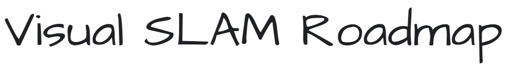

# Visual-SLAM Developer Roadmap - 2026

Visual-SLAM is a special case of '[Simultaneous Localization and Mapping](https://en.wikipedia.org/wiki/Simultaneous_localization_and_mapping)', which you use a camera device to gather exteroceptive sensory data.

Below there is a set of topics you need to understand in Visual-SLAM, from an absolute beginner difficulty to getting ready to become a Visual-SLAM engineer / researcher.

 

***

Visual-SLAM is often portrayed as a rather difficult topic - many think good C++ programming skills and deep understanding of mathematics is necessary.

On the other hand, there are not many courses provided for beginners, especially in non-English languages.

I made these charts to share my thoughts and experience on studying Visual-SLAM, and hopefully the beginner learners can get a grasp of where to start from.

 

***
<h3 align="center"><strong>Purpose of these Roadmaps</strong></h3>

> The purpose of these roadmaps is to give you an idea about the general overview of Visual-SLAM, and to guide you if you are confused about where to start from.

<h3 align="center"><strong>Note to Beginners</strong></h3>

> Acknowledge that SLAM has a relatively high entry barrier - it's not because of the requirement of undertanding difficult mathematics, but the requirement of equipping yourself with various types of skills. Don't feel overwhelmed - you don't need to learn everything if you are just getting started. Instead, enjoy the journey itself and progress topic by topic. The result will be very rewarding.

 

***

 

## Table of Contents

| Level | Topic | Focus |
|:-----:|-------|-------|
| **1** | [Beginner](#level-1-beginner) | Programming, Math, Projective Geometry, Camera, Image |
| **2** | [Getting Familiar](#level-2-getting-familiar-with-slam) | Feature matching, MVG, Optimization, Factor Graph, Mapping, Sensors |
| **3** | [Monocular SLAM](#level-3-monocular-visual-slam) | Feature/Direct/Hybrid/Learning-based, Foundation Model, Neural Representation, Semantic |
| **4** | [RGB-D SLAM](#level-4-rgb-d-visual-slam) | KinectFusion, ElasticFusion, BundleFusion, DSP-SLAM |
| **5** | [Deep Learning + SLAM](#level-5-applying-deep-learning) | A. Frontend · B. Backend · C. Systems · D. Scene Understanding |
| **6** | [VIO / VINS](#level-6-vio--vins) | Filter-based (MSCKF) vs Optimization-based (VINS-Mono, OKVIS2-X) |
| **7** | [Stereo SLAM](#level-7-stereo-slam) | S-PTAM, ORB-SLAM2/3 stereo, LDSO |
| **8** | [Collaborative SLAM](#level-8-collaborative--multi-robot-slam) | CCM-SLAM, Kimera-Multi, Swarm-SLAM |
| **9** | [LiDAR & Visual-LiDAR](#level-9-lidar--visual-lidar-fusion-slam) | LOAM, FAST-LIO2, LVI-SAM, R3LIVE, FAST-LIVO2 |
| **10** | [Event Camera SLAM](#level-10-event-camera-slam) | EVO, Ultimate-SLAM, DEVO |
| **11** | [World Models & Spatial AI](#level-11-world-models--spatial-ai) | GAIA-1, Cosmos, VLM/VLA, Generative 3D |

---

## Level 1: Beginner

### Programming
- **C++**: Pointer, OOP
- **Python**
- **Bash/Linux**: Basic terminal usage

### Mathematics
- **Basic Probability & Statistics**: Gaussian distribution, Bayes' theorem
- **Basic Linear Algebra**: Vectors & Matrices, Determinant, Dot & Cross product, Rank, Inverse matrix, Transpose matrix, SVD, Eigenvalues/Eigenvectors
- **Logarithm & Exponential**
- **Basic Calculus**: Differentiation, Taylor expansion

### Projective Geometry
- **Pinhole camera model** → Image projection
- **Camera calibration**: Intrinsic/Extrinsic parameters, Lens distortion
- **Rigid body motion**: Euler/Quaternion/Rotation Matrix, Projective space & Vanishing point, Homogeneous transformation
- **Epipolar geometry** → Essential & Fundamental matrix
- **Triangulation**

### Camera Device
- Lens, Sensor, Resolution/ISO/Aperture

### Image Data
- Colour image, Resolution, Grayscale image
- Thresholding, Gaussian blur
- **Corner detector**: Harris corner
- **Edge detector**: Sobel & Canny Edge
- Stereovision, RGB-D, Disparity, Depth

---

## Level 2: Getting Familiar with SLAM

### Programming
- **C++**: OOP, Modern C++, Data structures & Algorithms, Compilers, CMake/Makefile/Ninja, Design patterns, OpenCV C++
- **C**
- **Git/GitHub**
- **OpenCV** (opencv-python)
- **Python**: Deep learning, Graph plots, System scripts
- **Bash/Linux**: ssh, CLI text editor/Vim/tmux
- **Concurrency**: SIMD-SSE/AVX/Neon, OpenMP, CUDA
- **Mobile**: Android (Java/Kotlin), iOS (Objective-C/Swift)
- **Maths library**: Eigen, Ceres-solver/GTSAM/g2o
- **C++/Python interop**: PyBind11, nanobind
- **Docker**
- **C#**: COLMAP, Unity AR, Microsoft Hololens
- **CI/CD**: GitHub Actions, Apache Airflow
- **ROS/ROS2**
- **Simulation**: Gazebo, Isaac Sim

### Image Processing
- **Keypoints** → Detector/Descriptor
  - SIFT, FAST, ORB, AKAZE
  - Deep features: R2D2, Superpoint
- Image pyramid, oFAST, rBRIEF

### Local Feature Matching
- Brute-Force, FLANN, Kd-Tree
- LSH, Multi-probe LSH, HBST
- Superglue

### Global Feature Matching
- Bag of Visual Words, NetVLAD
- Deep image retrieval, Hierarchical localization

### Feature Tracking
- Optical flow, KLT Tracker

### Multiple View Geometry
- **2D-2D correspondence**: Essential/Fundamental, Homography
- **2D-3D correspondence**: P3P, PnP, SVD
- **3D-3D correspondence**: ICP

### Outlier Rejection
- RANSAC, PROSAC, M-Estimator, MAXCON, Convex relaxation

### Least Squares Optimisation
- Reprojection error, Bundle adjustment
- Non-linear optimisation, Lie algebra
- **Lie groups**: SO(3), SE(3)
- Gauss-Newton, Levenberg-Marquardt
- **Pose graph optimization**
- **Schur complement / Sparsity**

### Motion Model
- **Proprioceptive sensor**: IMU, Wheel
- **Odometry** (pose)

### Observation Model
- **Exteroceptive sensor**: Camera, LiDAR
- **Landmark** (Map)
- Joint optimisation, MLE & MAP

### Factor Graph Optimisation

### Mapping
- Point cloud, Occupancy grid mapping, TSDF, Surfel, Voxel map

### Sensors
- **Camera device**: Wide/telecentric lens, Lens MTF, CCD/CMOS, Rolling/Global shutter, Exposure/ISO, Stereovision, RGB-D, Structured light, Active IR/ToF
- **LiDAR** → Visual-LiDAR fusion
- **IMU** → VIO
- **RADAR** → Sensor fusion, Extended Kalman filter
- **Sonar**
- **Multi-sensor calibration**: Camera-IMU, Camera-LiDAR

### Evaluation
- **Metrics**: ATE (Absolute Trajectory Error), RPE (Relative Pose Error)
- **Datasets**: KITTI, TUM RGB-D, EuRoC

### Next Levels
Monocular SLAM · VIO/VINS · Stereo SLAM · Visual-LiDAR Fusion · RGB-D SLAM · Collaborative SLAM · Deep SLAM/Localization

---

## Level 3: Monocular Visual-SLAM

### Key Concepts
- **VO vs SLAM** — VO is local (no loop closure), SLAM includes global map + loop closure
- **Scale ambiguity** — Fundamental limitation of monocular SLAM; absolute scale is unrecoverable from images alone
- **Covisibility graph** — Shared map point visibility between keyframes; core data structure in ORB-SLAM
- **Visual Place Recognition (VPR)** — Recognising previously visited places for loop closure
- **Self-supervised depth** — Learning monocular depth without ground truth (Monodepth2, Godard 2019)

### Feature-based SLAM

| System | Author/Year | Key Concepts |
|--------|-------------|--------------|
| Visual Odometry | Nister 2004 | Fundamental matrix, Triangulation, VO (local-only, no loop closure) |
| [**MonoSLAM**](https://ieeexplore.ieee.org/document/4160954) | Davison 2007 | **First real-time monocular SLAM**, EKF-based, single camera, sparse 3D map, probabilistic feature initialization |
| [PTAM](https://www.robots.ox.ac.uk/~gk/publications/KleinMurray2007ISMAR.pdf) | Klein & Murray 2007 | FAST feature, Tracking, **Frontend/Backend separation**, Parallel threads, Keyframe, Mapping, Bundle adjustment, Manual initialisation |
| Visual-SLAM why filter? | Strasdat 2012 | Bundle adjustment, Scale-aware BA, Motion-only BA |
| [**ORB-SLAM**](https://arxiv.org/abs/1502.00956) | Mur-Artal 2015 | ORB keypoint, **Automatic initialisation (Homography vs Fundamental selection)**, Tracking thread, Sliding-window BA, Local mapping, Large-scale, Loop closure, Bag of visual words, Global optimisation, Covisibility graph, **Map point management (culling, merging)** |
| [Pop-up SLAM](https://arxiv.org/abs/1703.07334) | Yang 2016 | Line/Plane features |
| [PL-SLAM](https://arxiv.org/abs/1701.05750) | Pumarola 2017 | Point/Line features |
| [**ORB-SLAM2**](https://arxiv.org/abs/1610.06475) | Mur-Artal 2017 | → Stereo SLAM, → RGB-D SLAM |
| [CubeSLAM](https://arxiv.org/abs/1806.00557) | Yang 2019 | Monocular 3D cuboid detection + SLAM, 9-DoF object representation |
| [OpenVSLAM](https://arxiv.org/abs/1910.01122) | Sumikura 2019 | — |
| [**Stella-VSLAM**](https://github.com/stella-cv/stella_vslam) | (fork) 2021 | OpenVSLAM successor, license reboot |
| [UcoSLAM](https://arxiv.org/abs/1908.06708) | Munoz-Salinas 2019 | Fiducial markers |
| DeepFusion | LaidLow 2019 | — |
| [**ORB-SLAM3**](https://arxiv.org/abs/2007.11898) | Campos 2020 | Monocular + Stereo + VIO, Multi-map, IMU integration |
| [DXSLAM](https://arxiv.org/abs/2008.05805) | Li 2020 | Deep features for SLAM |
| [**PyCuVSLAM**](https://github.com/NVIDIA-AI-IOT/isaac_ros_visual_slam) | NVIDIA 2026 | Python + CUDA GPU-accelerated VSLAM toolkit (cuVSLAM wrapper) |

### Direct SLAM

| System | Author/Year | Key Concepts |
|--------|-------------|--------------|
| [**DTAM**](https://ieeexplore.ieee.org/document/6126513) | Newcombe 2011 | Dense mapping, Keyframe mapping, GPGPU |
| [**LSD-SLAM**](https://arxiv.org/abs/1407.3260) | Engel 2014 | Photometric error minimisation, High gradient pixels/edges, Large scale, Loop closure, Pose graph optimisation |
| [**DSO**](https://arxiv.org/abs/1607.02565) | Engel 2016 | Photometric bundle adjustment, Sliding window BA, No loop closure/global optimisation |
| [**LDSO**](https://arxiv.org/abs/1808.01111) | Gao 2018 | DSO + Loop closure (BoW-based), addresses DSO's main weakness |
| [CNN-SLAM](https://arxiv.org/abs/1704.03489) | Tateno 2017 | Depth from LSD-SLAM + deep depth, Semantic label |
| [DVSO](https://arxiv.org/abs/1807.02570) | Yang 2018 | Deep single image depth estimation, StackNet |
| [Basalt](https://arxiv.org/abs/1904.06504) | Usenko 2020 | Non-linear recovery (→ primarily VIO, see Level 6) |
| [D3VO](https://arxiv.org/abs/2003.01444) | Yang 2020 | Deep single image depth estimation, Deep pose, Deep aleatoric uncertainty |

### Hybrid (Feature + Direct)

| System | Author/Year | Key Concepts |
|--------|-------------|--------------|
| [SVO](https://ieeexplore.ieee.org/document/6906584) | Forster 2014 | FAST feature detection, Direct-based feature tracking, Bundle adjustment |
| [SVO2](https://arxiv.org/abs/1610.06654) | Forster 2017 | Multi-camera/Fisheye, Probabilistic depth estimation, Direct method convergence, Sparse method |
| Stereo DSO | Wang 2017 | → Stereo SLAM |
| VI-DSO | Gao 2018 | → VIO/VINS |

### Learning-based SLAM

| System | Author/Year | Key Concepts |
|--------|-------------|--------------|
| [**DROID-SLAM**](https://arxiv.org/abs/2108.10869) | Teed 2021 | Differentiable BA, dense optical flow, end-to-end learned |
| [TartanVO](https://arxiv.org/abs/2011.00359) | Wang 2021 | Generalizable visual odometry |
| [**DPV-SLAM / DPVO**](https://arxiv.org/abs/2208.04726) | Teed 2023 | DROID-SLAM lightweight, patch-based visual odometry |
| [MAC-VO](https://arxiv.org/abs/2409.09479) | Qu 2024 | Learning-based VO, metric-aware |
| [**VoT**](https://vladimiryugay.github.io/vot/) | Yugay 2025 | Visual Odometry with Transformers |

### Foundation Model SLAM

| System | Author/Year | Key Concepts |
|--------|-------------|--------------|
| [**DUSt3R**](https://arxiv.org/abs/2312.14132) | Wang 2024 | Pointmap regression from image pairs, no calibration needed |
| [**MASt3R**](https://arxiv.org/abs/2406.09756) | Leroy 2024 | DUSt3R + local feature matching |
| [**MASt3R-SLAM**](https://arxiv.org/abs/2501.00007) | Leroy 2024 | Real-time dense SLAM from MASt3R |
| [**VGGT**](https://arxiv.org/abs/2503.11651) | Wang (Meta) 2025 | Feed-forward inference of poses, depths, pointmaps, tracks from N views (**CVPR 2025 Best Paper**) |
| [**VGGT-SLAM**](https://arxiv.org/abs/2504.18904) | 2025 | VGGT as frontend for real-time SLAM |
| **VGGT-SLAM 2.0** | 2026 | Improved VGGT-SLAM |
| [**VGGT-Geo**](https://arxiv.org/abs/2507.01083) | 2026 | Probabilistic geometric fusion of VGGT priors for dense indoor SLAM |
| **IGGT** | Li 2026 | VGGT + VLM — language-grounded 3D geometry |
| [**AMB3R**](https://hengyiwang.github.io/projects/amber/) | Wang 2025 | MASt3R frontend + Transformer backend for SfM/SLAM |
| [**MASt3R-Fusion**](https://arxiv.org/abs/2504.11374) | WHU 2025 | MASt3R-SLAM + IMU + GNSS fusion |

#### SfM Tools

| System | Author/Year | Key Concepts |
|--------|-------------|--------------|
| [**InstantSfM**](https://arxiv.org/abs/2501.10726) | 2025 | GPU-accelerated SfM pipeline, 40× faster than COLMAP |

### Neural Representation SLAM

#### NeRF-based

| System | Author/Year | Key Concepts |
|--------|-------------|--------------|
| [**iMAP**](https://arxiv.org/abs/2103.12352) | Sucar 2021 | First NeRF-SLAM, single MLP, real-time tracking/mapping |
| [**BARF**](https://arxiv.org/abs/2104.06405) | Lin 2021 | Bundle-Adjusting NeRF, coarse-to-fine positional encoding, joint pose+NeRF opt (not full SLAM — pose+NeRF co-optimization) |
| [**NICE-SLAM**](https://arxiv.org/abs/2112.12130) | Zhu & Peng 2022 | Hierarchical feature grid (coarse/mid/fine), scalable |
| [**Co-SLAM**](https://arxiv.org/abs/2304.14377) | Wang 2023 | Hash grid (Instant-NGP) + coordinate encoding, 5-10× faster than NICE-SLAM |
| [**ESLAM**](https://arxiv.org/abs/2305.11835) | Johari 2023 | Tri-plane representation, O(N²) vs O(N³) memory |
| [**Point-SLAM**](https://arxiv.org/abs/2304.04278) | Sandström 2023 | Neural point cloud based |
| [**NeRF-SLAM**](https://arxiv.org/abs/2210.13641) | Rosinol 2023 | NeRF + classical SLAM pipeline |
| [**NICER-SLAM**](https://arxiv.org/abs/2302.03594) | Zhu 2024 | RGB-only NeRF-SLAM (no depth sensor), monocular depth integration |
| [**vMAP**](https://arxiv.org/abs/2306.06691) | Kong 2023 | Object-level NeRF-SLAM, per-object neural fields |
| [**GO-SLAM**](https://arxiv.org/abs/2309.10896) | Zhang 2023 | Global optimization + NeRF-SLAM, loop closure + global BA |

#### 3DGS-based

| System | Author/Year | Key Concepts |
|--------|-------------|--------------|
| [**SplaTAM**](https://arxiv.org/abs/2312.02126) | Keetha 2024 | First 3DGS-SLAM, RGB-D, silhouette-guided densification |
| [**MonoGS**](https://arxiv.org/abs/2405.18932) | Matsuki 2024 | Monocular 3DGS-SLAM, depth network + triangulation fusion |
| [**GS-ICP SLAM**](https://arxiv.org/abs/2403.12550) | Yu 2024 | Gaussian-to-Gaussian ICP (Mahalanobis distance), geometric tracking |
| [**Photo-SLAM**](https://arxiv.org/abs/2311.16728) | Huang 2024 | Explicit geometry + implicit appearance (MLP color), anti-aliasing |
| [**RTG-SLAM**](https://arxiv.org/abs/2404.19706) | 2024 | Real-time focus, adaptive Gaussian budget, Jetson Orin 25 FPS |
| [**EGG-Fusion**](https://arxiv.org/abs/2506.06132) | ZJU 2025 | Gaussian surfel fusion, information-filter-based, real-time 24 FPS |
| [**Online-Mono-3DGS (MODP)**](https://arxiv.org/abs/2508.14014) | 2025 | ORB-SLAM3 tracking + Hierarchical Gaussian Management |
| [**ActiveSplat**](https://arxiv.org/abs/2410.21955) | Li 2025 | Active mapping with 3DGS + Voronoi-based path planning |
| [**Open-S3SLAM**](https://arxiv.org/abs/2503.01646) | 2026 | Open-set semantic 3DGS SLAM for smartphones (ICRA 2026) |
| [**LEGS**](https://arxiv.org/abs/2409.18108) | 2025 | Language Embedded Gaussian Splats, real-time language-queryable 3D |

### Semantic / Language-Grounded SLAM

| System | Author/Year | Key Concepts |
|--------|-------------|--------------|
| [**ConceptFusion**](https://arxiv.org/abs/2302.07241) | Jatavallabhula (MIT) 2023 | CLIP features fused into 3D map, open-vocabulary language queries |
| [**LERF**](https://arxiv.org/abs/2303.09553) | Kerr 2023 | Language Embedded Radiance Fields, DINO multi-scale, NeRF + CLIP |
| [**OpenScene**](https://arxiv.org/abs/2211.15654) | Peng (ETH) 2023 | Language features back-projected to 3D point clouds |
| [**ConceptGraphs**](https://arxiv.org/abs/2309.16650) | Gu 2023 | Open-vocabulary 3D Scene Graph, SAM + CLIP + LLM spatial relations |
| [**SpatialLLM**](https://github.com/manycore-research/SpatialLM) | Mao 2025 | Point cloud → LLM, structured indoor modeling as Python scripts |

> Also see: [**LEGS**](https://arxiv.org/abs/2409.18108), [**Open-S3SLAM**](https://arxiv.org/abs/2503.01646) (3DGS-based section above); [**Open-YOLO 3D**](https://arxiv.org/abs/2512.19088) (Level 5 Object Detection)

---

## Level 4: RGB-D Visual-SLAM

### RGB-D Camera Devices
- Intel RealSense D series
- Microsoft Kinect v1/v2
- Azure Kinect DK
- Occipital Structure Core
- Orbbec Astra

### GPGPU Programming
- CUDA, OpenGL GLSL

### Systems

| System | Author/Year | Key Concepts |
|--------|-------------|--------------|
| ICP | Besl & McKay 1992 | — |
| DTAM | Newcombe 2011 | — |
| [**KinectFusion**](https://ieeexplore.ieee.org/document/6162880) | Newcombe 2011 | GPGPU, Tracking (project depth → 3D, surface normal, coarse-to-fine ICP), Mapping (volumetric integration, TSDF), Robust to small scene changes, Cannot model deformation, Map growth cubic, Room-size only |
| Double Window Optimisation | Strasdat 2011 | — |
| [Kintinuous](https://ieeexplore.ieee.org/document/6907054) | Whelan 2012 | Volume shift, Geometric, Photometric, dBoW+SURF, Optimisation, Loop closure |
| RGBD-SLAM-V2 | Endres 2013 | Tracking (colour image, visual features, depth image, point cloud, transformation), Mapping (OctoMap 2013) |
| [SLAM++](https://ieeexplore.ieee.org/document/6619022) | Salas-Moreno 2013 | Object-oriented SLAM |
| DVO | Kerl 2013 | Keyframe, Depth, Direct method, Optimisation, Loop closure |
| RTAB-Map | Labbé 2014 | Loop closure, Map merge, Multi-session memory management |
| MRS-Map | Stuckler 2014 | — |
| [**ElasticFusion**](https://ieeexplore.ieee.org/document/7274882) | Whelan 2015 | Active: frame-to-model tracking (photometric + geometric), joint optimisation, fused surfel-based model reconstruction · Inactive: local loop closure (model-to-model local surface, submodel separation), global loop closure (randomised fern encoding, non-rigid space deformation) |
| [DynamicFusion](https://ieeexplore.ieee.org/document/7298631) | Newcombe 2015 | 6D motion field, Deformable scene |
| ORB-SLAM2 | Mur-Artal 2016 | Bundle adjustment, Sparse reconstruction |
| [**BundleFusion**](https://arxiv.org/abs/1604.01093) | Dai 2016 | Local-to-global optimisation, Sparse RGB feature, Coarse global pose estimation, Fine pose refinement (geometric + photometric) |
| [SemanticFusion](https://arxiv.org/abs/1609.05130) | McCormac 2016 | Deep Learning CNN, Deep Semantic SLAM |
| [InfiniTAM v3](https://arxiv.org/abs/1708.00781) | Prisacariu 2017 | Tracking (scene raycast, depth image, RGB image), Relocalisation (random ferns), Mapping (TSDF reconstruction, voxel hashing, surfel reconstruction) |
| [Fusion++](https://arxiv.org/abs/1808.08378) | McCormac & Clark 2018 | Deep Learning CNN, Mask-RCNN instance segmentation, Object-level SLAM, No prior, Object-level TSDF reconstruction |
| PointFusion / DenseFusion | Xu 2018 / Wang 2019 | RGB-D object pose estimation, Tracking, Relocalisation, Loop closure detection |
| [BAD SLAM](https://arxiv.org/abs/1903.08730) | Schops 2019 | Direct bundle adjustment, Deep Semantic SLAM |
| RTAB-Map v2 | Labbé 2019 | RGB-D/LiDAR, Light-source detection (2016) |
| [**MoreFusion**](https://arxiv.org/abs/2004.04336) | Wada & Sucar 2020 | DL instance segmentation, Object-level volumetric fusion, Volumetric pose prediction, 3D scene reconstruction, Collision-based refinement, Semantic SLAM, Object pose estimation, CAD object fitting |
| NodeSLAM | Wada & Sucar 2020 | Occupancy VAE, Object-level SLAM (→ also in Level 5 Latent Representation) |
| Kimera / 3D Dynamic Scene Graph | Rosinol 2020 | Kimera-VIO, Kimera-Mesher, Kimera-PGMO, Kimera-Semantics, Kimera-DSG |
| [**DSP-SLAM**](https://arxiv.org/abs/2108.09481) | Wang (UCL) 2021 | DeepSDF shape prior + ORB-SLAM2, object-level dense reconstruction (mono/stereo/LiDAR) |

---

## Level 5: Applying Deep Learning

> Level 5 is organized into four pillars:
> **A. Frontend** — learned perception components replacing hand-crafted modules
> **B. Backend** — learned/certifiable optimization replacing classical solvers
> **C. Systems** — end-to-end deep VO/SLAM pipelines
> **D. Scene Understanding** — semantic, language, and relational reasoning on SLAM maps

---

### A. Deep Frontend — Perception

#### Feature Detection & Matching

| System | Author/Year | Key Concepts |
|--------|-------------|--------------|
| [**NetVLAD**](https://arxiv.org/abs/1511.07247) | Arandjelovic 2016 | VLAD, place recognition |
| [**SuperPoint**](https://arxiv.org/abs/1712.07629) | DeTone 2017 | Homographic Adaptation, Self-supervised, VGG encoder + detector/descriptor heads |
| [HardNet](https://arxiv.org/abs/1705.10872) | Mishchuk 2017 | Learned local descriptor |
| [**R2D2**](https://arxiv.org/abs/1906.06195) | Revaud 2019 | Repeatable + Reliable detector/descriptor, explicit repeatability/reliability maps |
| [KeyNet](https://arxiv.org/abs/1904.00889) | Barroso-Laguna 2019 | Learned keypoint detector |
| [**HF-Net**](https://arxiv.org/abs/1812.03506) | Sarlin 2019 | Global feature, Local feature, Visual localization |
| [**SuperGlue**](https://arxiv.org/abs/1911.11763) | Sarlin 2020 | Self/Cross-attention GNN, Sinkhorn optimal assignment, dustbin for outliers |
| [**DISK**](https://arxiv.org/abs/2006.13566) | Tyszkiewicz 2020 | Policy gradient (RL) training, match success/failure as reward |
| [Patch NetVLAD](https://arxiv.org/abs/2103.01486) | Hausler 2021 | Multi-scale patch-level VLAD |
| [**LoFTR**](https://arxiv.org/abs/2104.00680) | Sun 2021 | Detector-free, Transformer coarse-to-fine dense matching |
| [**LightGlue**](https://arxiv.org/abs/2306.13643) | Lindenberger 2023 | Adaptive depth/width, 5-10× faster than SuperGlue |
| [**XFeat**](https://arxiv.org/abs/2404.19174) | Potje 2024 | 0.3M params, 1400 FPS (RTX 4090), 64-dim descriptor, embedded-friendly |
| [**RoMA**](https://arxiv.org/abs/2305.15404) | Edstedt 2024 | DINOv2 foundation feature + coarse-to-fine dense matching |
| [**DeDoDe**](https://arxiv.org/abs/2308.08479) | Edstedt 2024 | Joint detect-and-describe in one stage |
| [**RoMA V2**](https://arxiv.org/abs/2411.07969) | Edstedt 2026 | Improved RoMA |

#### Depth Estimation

| System | Author/Year | Key Concepts |
|--------|-------------|--------------|
| [MonoDepth](https://arxiv.org/abs/1609.03677) | Godard 2016 | Left-Right photometric consistency, self-supervised |
| [**MiDaS**](https://arxiv.org/abs/1907.01341) | Ranftl 2020 | Multi-dataset mixing, scale-and-shift invariant loss, relative depth |
| [**DPT**](https://arxiv.org/abs/2103.13413) | Ranftl 2021 | Dense Prediction Transformer (ViT backbone), global context |
| [**ZoeDepth**](https://arxiv.org/abs/2302.12288) | Bhat 2023 | Zero-shot metric depth, Metric Bins Module |
| [**Metric3D**](https://arxiv.org/abs/2307.10984) | Yin 2023 | Camera intrinsic-conditioned metric depth, Canonical Camera Space |
| [**Depth Anything**](https://arxiv.org/abs/2401.10891) | Yang 2024 | 62M images, foundation model for monocular depth |
| [**Depth Anything V2**](https://arxiv.org/abs/2406.09414) | Yang 2024 | Improved with synthetic data, better edge preservation |
| [**Marigold**](https://arxiv.org/abs/2312.02145) | Ke 2024 | Stable Diffusion for depth, fine detail, uncertainty via sampling |
| [**Align3r**](https://arxiv.org/abs/2412.04079) | Melou 2025 | Video temporal consistency, DUSt3R-based, CVPR 2025 Highlight |
| [**Masked Depth Modeling (LingBot-Depth)**](https://arxiv.org/abs/2501.15695) | 2026 | Fixes RGB-D failures on glass/mirrors/metal |

#### Optical Flow & Scene Flow

| System | Author/Year | Key Concepts |
|--------|-------------|--------------|
| [**FlowNet**](https://arxiv.org/abs/1504.06852) | Dosovitskiy 2015 | First end-to-end deep optical flow (SimpleNet / CorrNet) |
| [**FlowNet 2.0**](https://arxiv.org/abs/1612.01925) | Ilg 2017 | Stacked networks, classical-level accuracy |
| [**PWC-Net**](https://arxiv.org/abs/1709.02371) | Sun 2018 | Pyramid-Warping-Cost volume, coarse-to-fine, 8.4M params |
| [**FlowNet3D**](https://arxiv.org/abs/1806.01411) | Liu 2019 | Point cloud scene flow, PointNet++ based |
| [**RAFT**](https://arxiv.org/abs/2003.12039) | Teed 2020 | All-Pairs Correlation + iterative ConvGRU update, **ECCV Best Paper** |
| [**RAFT-3D**](https://arxiv.org/abs/2012.09740) | Teed 2021 | Scene flow (3D motion) from RAFT |
| [**FlowFormer**](https://arxiv.org/abs/2203.16194) | Huang 2022 | Transformer on cost volume tokens, global context |
| [**SEA-RAFT**](https://arxiv.org/abs/2405.14793) | 2024 | Efficient RAFT variant for real-time |

#### Camera Pose Regression & Relocalization

| System | Author/Year | Key Concepts |
|--------|-------------|--------------|
| [**PoseNet**](https://arxiv.org/abs/1505.07427) | Kendall 2015 | CNN-based 6-DoF pose regression (APR), GoogLeNet backbone |
| [**DSAC**](https://arxiv.org/abs/1611.05705) | Brachmann 2017 | Differentiable RANSAC, Scene Coordinate Regression (SCR) |
| [**DSAC++**](https://arxiv.org/abs/1711.10228) | Brachmann 2018 | Self-supervision, RGB-D support |
| CNN Pose Regression Limitations | Sattler 2019 | Pose regression ≈ image retrieval performance |
| LM-Reloc | von Stumberg 2020 | Deep direct relocalization |
| [**DSAC**](https://arxiv.org/abs/1611.05705)* | Brachmann 2021 | Improved learning stability |
| [**ACE**](https://arxiv.org/abs/2305.14299) | Brachmann 2023 | Accelerated Coordinate Encoding, 5-min training per scene |
| [**ACE Zero**](https://arxiv.org/abs/2404.14351) | Brachmann 2024 | Zero-shot SCR, no pre-built 3D map needed |
| [**ACE-G**](https://arxiv.org/abs/2501.12753) | Brachmann 2024 | Generalizable SCR via cross-attention, new scenes without fine-tuning |
| [**ACE-SLAM**](https://arxiv.org/abs/2512.14032) | Tang 2024 | Neural implicit real-time SLAM, network weights = map |
| [**hloc**](https://arxiv.org/abs/1812.03506) | Sarlin 2019+ | Hierarchical Localization: coarse (NetVLAD) → fine (SuperGlue) pipeline |

#### Object Detection & Segmentation for SLAM

| System | Author/Year | Key Concepts |
|--------|-------------|--------------|
| **YOLO** (v1→v11) | Redmon 2016→2024 | Real-time object detection, Ultralytics ecosystem |
| [**DETR**](https://arxiv.org/abs/2005.12872) | Carion 2020 | Transformer detection, anchor-free, no NMS |
| [**RT-DETR**](https://arxiv.org/abs/2304.08069) | Lv (Baidu) 2023 | Real-time DETR, YOLO-speed + Transformer quality |
| [**SAM**](https://arxiv.org/abs/2304.02643) | Kirillov 2023 | Segment Anything, prompt-based, Foundation Model |
| [**SAM 2**](https://arxiv.org/abs/2408.00714) | Meta 2024 | Video segmentation, Memory Attention, temporal consistency |
| [**Grounding DINO**](https://arxiv.org/abs/2303.05499) | Liu 2023 | Text-prompted detection → SAM pipeline (Grounded SAM) |
| [**Open-YOLO 3D**](https://arxiv.org/abs/2512.19088) | Benseddik 2025 | 2D open-vocab detection → 3D instance seg, 16× faster |

---

### B. Deep Backend — Optimization

#### Differentiable Bundle Adjustment

| System | Author/Year | Key Concepts |
|--------|-------------|--------------|
| [**BA-Net**](https://arxiv.org/abs/1806.04807) | Tang 2019 | FPN + differentiable LM layer, end-to-end SfM (ICLR) |
| [**DROID-SLAM**](https://arxiv.org/abs/2108.10869) | Teed 2021 | Dense optical flow + differentiable dense BA, all-pixels reprojection |
| [**DPVO**](https://arxiv.org/abs/2208.04726) | Teed 2023 | Patch-based DROID-SLAM, 30+ FPS real-time |
| [**Theseus**](https://arxiv.org/abs/2207.09442) | Pineda (Meta) 2022 | Differentiable nonlinear optimization library (PyTorch) |
| [**Lietorch**](https://github.com/princeton-vl/lietorch) | Teed 2021 | Lie group operations for PyTorch (SE(3)/SO(3)) |

#### Certifiably Optimal Algorithms

| System | Author/Year | Key Concepts |
|--------|-------------|--------------|
| [**SE-Sync**](https://arxiv.org/abs/1611.00128) | Rosen 2019 | Certifiable pose graph optimization via SDP + Riemannian opt |
| [**TEASER++**](https://arxiv.org/abs/2001.07715) | Yang 2020 | Point cloud registration, 90%+ outlier robust, TLS + Max Clique (T-RO/RSS 2020) |
| [**GNC**](https://arxiv.org/abs/1909.08605) | Yang 2020 | Graduated Non-Convexity, continuation from convex → robust cost |
| [**QUASAR**](https://arxiv.org/abs/2006.10643) | Yang 2022 | Certifiable rotation averaging, SDP + robust cost |

#### Gaussian Belief Propagation & Graph Processors

| System | Author/Year | Key Concepts |
|--------|-------------|--------------|
| [**FutureMapping 1**](https://arxiv.org/abs/1803.11288) | Davison 2018 | Computational structure of Spatial AI, GBP for SLAM |
| [**FutureMapping 2**](https://arxiv.org/abs/1910.14139) | Ortiz 2019 | GBP as core Spatial AI primitive, visual intro to GBP |
| [**BA on Graph Processor**](https://arxiv.org/abs/2003.03134) | Ortiz 2020 | Bundle Adjustment on Graphcore IPU, tile-based parallelism |
| [**DANCeRS**](https://arxiv.org/abs/2308.12795) | 2023 | GBP-based distributed consensus in robot swarms |

---

### C. End-to-End Deep VO / SLAM Systems

#### Self-supervised & Learned VO

| System | Author/Year | Key Concepts |
|--------|-------------|--------------|
| [DeepVO](https://arxiv.org/abs/1709.08429) | Wang 2017 | Supervised learning |
| [SfM-Learner](https://arxiv.org/abs/1704.07813) | Zhou 2017 | Unsupervised, deep depth + deep pose |
| [DeMoN](https://arxiv.org/abs/1612.02401) | Ummenhofer 2017 | Depth + Motion from two frames, encoder-decoder |
| [UndeepVO](https://arxiv.org/abs/1709.06841) | Li 2018 | Stereo self-supervised, absolute scale recovery |
| [DeepTAM](https://arxiv.org/abs/1805.00170) | Zhou 2018 | Deep tracking and mapping, cost volume based |
| [DeepV2D](https://arxiv.org/abs/1812.04605) | Teed 2018 | Iterative depth from video, differentiable geometry layers |
| Depth from Video in the Wild | Gordon 2019 | Unconstrained video depth, learned camera intrinsics |
| Neural Ray Surfaces | Vasiljevic 2020 | Learned ray surface model, non-pinhole cameras |
| [GradSLAM](https://arxiv.org/abs/1910.10672) | Murthy 2020 | Differentiable SLAM framework (PyTorch, supports multiple SLAM backends) |
| DeepSLAM | Wang 2020 | TrackingNet, MappingNet, LoopNet |
| [MonoRec](https://arxiv.org/abs/2011.11814) | Wimbauer 2021 | Self-supervised monocular 3D reconstruction, moving objects |
| [TANDEM](https://arxiv.org/abs/2111.07418) | Koestler 2021 | Real-time tracking + dense mapping via MVS depth, DSO-based |
| [**DROID-SLAM**](https://arxiv.org/abs/2108.10869) | Teed 2021 | Dense BA + correlation, SOTA on TartanAir/EuRoC (→ see Differentiable BA) |
| [**DPVO**](https://arxiv.org/abs/2208.04726) | Teed 2023 | Patch-based lightweight DROID (→ see Differentiable BA) |

#### Latent Representation SLAM

| System | Author/Year | Key Concepts |
|--------|-------------|--------------|
| [**CodeSLAM**](https://arxiv.org/abs/1804.00874) | Bloesch 2018 | Depth as 128-dim latent code, photometric BA on codes + poses |
| [**SceneCode**](https://arxiv.org/abs/1903.06482) | Zhi 2019 | Depth + semantic in single latent code, cross-modal constraints |
| [**DeepFactors**](https://arxiv.org/abs/2001.05049) | Czarnowski 2020 | Probabilistic depth codes + factor graph, GPU 30+ FPS |
| [**NodeSLAM**](https://arxiv.org/abs/2004.04485) | Sucar 2020 | Object-level DeepSDF codes, occupancy VAE per object |
| [**CodeMapping**](https://arxiv.org/abs/2107.08994) | Shao 2021 | Sparse SLAM + learned dense mapping, hybrid approach |

#### Neural Rendering (reference)

> NeRF/3DGS-based SLAM systems → see **Level 3: Neural Representation SLAM**

| System | Author/Year | Key Concepts |
|--------|-------------|--------------|
| [**NeRF**](https://arxiv.org/abs/2003.08934) | Mildenhall 2020 | Neural Radiance Fields, novel view synthesis (foundational) |
| [**DIFIX3D+**](https://arxiv.org/abs/2501.14292) | 2026 | Single-step diffusion for 3D reconstruction artifact removal (post-processing) |

---

### D. Scene Understanding

#### Benchmarks & Foundations

| System | Author/Year | Key Concepts |
|--------|-------------|--------------|
| [**EFM3D**](https://arxiv.org/abs/2406.10853) | Straub (Meta) 2024 | Egocentric Foundation Model 3D benchmark, depth/surface/semantic from ego-video |

#### 3D Scene Graph

| System | Author/Year | Key Concepts |
|--------|-------------|--------------|
| [**Hydra**](https://arxiv.org/abs/2201.13360) | Hughes (MIT SPARK) 2022 | Real-time hierarchical Scene Graph (mesh→objects→places→rooms→buildings) |
| [**Hydra-Multi**](https://arxiv.org/abs/2307.00856) | Hughes 2023 | Distributed multi-robot 3D Scene Graph |
| [**Clio**](https://arxiv.org/abs/2404.13696) | Maggio (MIT SPARK) 2024 | Open-set task-driven Scene Graph, CLIP embeddings per node |
| [**Khronos**](https://arxiv.org/abs/2402.13817) | Schmid (MIT SPARK) 2024 | Spatio-temporal Scene Graph, dynamic object history tracking |
| [**ConceptGraphs**](https://arxiv.org/abs/2309.16650) | Gu 2023 | Open-vocabulary 3D Scene Graph, SAM + CLIP + LLM relations (→ also in L3 Semantic) |

---

## Level 6: VIO / VINS

### Key Concepts
- **Tightly-coupled vs Loosely-coupled** — Joint vs separate optimization of visual and inertial measurements
- **Filter-based vs Optimization-based** — EKF approaches vs nonlinear optimization (BA)
- **IMU preintegration** — On-manifold IMU integration between keyframes (Forster 2015)
- **IMU noise model** — Bias, random walk, Allan variance
- **Observability** — Yaw and global position are unobservable in VIO

### Foundations

| Resource | Author/Year | Key Concepts |
|----------|-------------|--------------|
| **Introduction to Inertial Navigation** | Woodman 2007 | IMU fundamentals, coordinate frames, error sources — essential prerequisite |
| [IMU Preintegration on Manifold](https://arxiv.org/abs/1512.02363) | Forster 2015 | On-manifold preintegration, bias correction without re-integration |
| Quaternion kinematics for error-state KF | Sola 2017 | Quaternion math, error-state formulation |

### Filter-based

| System | Author/Year | Key Concepts |
|--------|-------------|--------------|
| [**MSCKF**](https://ieeexplore.ieee.org/document/4209642) | Mourikis 2007 | Multi-State Constraint KF, efficient VIO without landmarks in state |
| [ROVIO](https://arxiv.org/abs/1512.02325) | Bloesch 2015 | Robocentric VIO, direct photometric tracking + EKF |
| [**OpenVINS**](https://docs.openvins.com/) | Geneva 2020 | Open-source MSCKF, modular, extensible |

### Optimization-based

| System | Author/Year | Key Concepts |
|--------|-------------|--------------|
| [OKVIS](https://journals.sagepub.com/doi/10.1177/0278364914554813) | Leutenegger 2015 | Keyframe-based, tightly-coupled, sliding window optimization |
| [**VINS-Mono**](https://arxiv.org/abs/1708.03852) | Qin 2018 | Tightly-coupled, relocalization, loop closure, pose graph optimization |
| [VINS-Fusion](https://arxiv.org/abs/1901.03638) | Qin 2019 | Stereo + GPS fusion extension |
| MAPLAB | Schneider 2018 | Multi-session visual-inertial mapping framework |
| [**Kimera-VIO**](https://arxiv.org/abs/1910.02490) | Rosinol 2020 | Fast VIO frontend for Kimera pipeline, structureless vision factors |
| [Basalt](https://arxiv.org/abs/1904.06504) | Usenko 2020 | Non-linear recovery, visual-inertial odometry + mapping |
| [**ORB-SLAM3**](https://arxiv.org/abs/2007.11898) | Campos 2020 | VIO mode, multi-map, IMU initialization |
| [**DM-VIO**](https://arxiv.org/abs/2112.01684) | von Stumberg 2022 | Deep monocular VIO, delayed marginalization |
| [**OKVIS2**](https://arxiv.org/abs/2202.09199) | Leutenegger 2022 | Multi-session, improved marginalization |
| AirVO | Xu 2023 | Point-line VIO, illumination-robust |
| [**OKVIS2-X**](https://arxiv.org/abs/2510.04612) | Boche & Leutenegger 2025 | Multi-sensor SLAM (Visual+Inertial+Depth+LiDAR+GNSS), dense volumetric occupancy maps, submapping for large-scale (9km+), EuRoC/Hilti22 SOTA |

---

## Level 7: Stereo SLAM

### Key Concepts
- **Stereo rectification** — Epipolar alignment for efficient disparity search
- **Disparity vs Depth** — d = f·B/Z, baseline determines depth range/accuracy
- **Scale observability** — Stereo provides metric scale (unlike monocular)

### Systems

| System | Author/Year | Key Concepts |
|--------|-------------|--------------|
| [**S-PTAM**](https://arxiv.org/abs/1706.09989) | Pire 2017 | Stereo PTAM, ROS-compatible, real-time |
| [**ORB-SLAM2**](https://arxiv.org/abs/1610.06475) (stereo) | Mur-Artal 2016 | Stereo + RGB-D modes, loop closure, relocalization |
| [**StereoMSCKF**](https://arxiv.org/abs/1712.00036) | Sun 2018 | MSCKF with stereo, efficient for resource-constrained platforms |
| [**RTAB-Map**](https://ieeexplore.ieee.org/document/6942560) | Labbé 2019 | Multi-sensor (stereo/RGB-D/LiDAR), memory management, large-scale |
| [**ORB-SLAM3**](https://arxiv.org/abs/2007.11898) (stereo) | Campos 2020 | Multi-map, Atlas, stereo + IMU |
| [**Stella-VSLAM**](https://github.com/stella-cv/stella_vslam) | Community 2022 | Open-source fork of OpenVSLAM, stereo support |
| [**LDSO**](https://arxiv.org/abs/1808.01111) | Gao 2018 | Direct stereo odometry with loop closure (DSO extension) |

---

## Level 8: Collaborative / Multi-Robot SLAM

### Key Concepts
- **Centralized vs Decentralized** — Single server vs peer-to-peer map merging
- **Inter-robot loop closure** — Place recognition across robots with different viewpoints
- **Communication constraints** — Bandwidth-limited map sharing, sparse descriptors
- **Map merging** — Aligning submaps from different robots into a global map

### Systems

| System | Author/Year | Key Concepts |
|--------|-------------|--------------|
| [**C2TAM**](https://ieeexplore.ieee.org/document/6696630) | Riazuelo 2014 | Cloud-based collaborative monocular SLAM |
| [**CCM-SLAM**](https://arxiv.org/abs/1807.00714) | Schmuck & Chli 2019 | Centralized collaborative monocular SLAM, robust to comm failures |
| [**DOOR-SLAM**](https://arxiv.org/abs/1909.12198) | Lajoie 2020 | Distributed, outlier-resilient SLAM with pairwise consistency |
| [**Kimera-Multi**](https://arxiv.org/abs/2106.14386) | Tian 2022 | Distributed multi-robot metric-semantic SLAM, mesh reconstruction |
| [**Swarm-SLAM**](https://arxiv.org/abs/2301.06230) | Lajoie 2024 | Decentralized, sparse, scalable C-SLAM, supports LiDAR/stereo/RGB-D |
| [**CoPeD-Advancing**](https://arxiv.org/abs/2405.14731) | Stathoulopoulos 2024 | Multi-robot collaborative perception for autonomous exploration |
| [**MAPLAB 2.0**](https://arxiv.org/abs/2212.00654) | Cramariuc 2023 | Multi-session, multi-robot visual-inertial mapping |

---

## Level 9: LiDAR & Visual-LiDAR Fusion SLAM

### Key Concepts
- **LiDAR-Visual-Inertial (LVI)** — Triple fusion for robust outdoor SLAM
- **Tightly-coupled LiDAR-camera** — Joint optimization of point cloud and visual features
- **Direct LiDAR-camera alignment** — Photometric/geometric alignment without feature extraction
- **Degradation handling** — Graceful fallback when one modality fails (e.g., LiDAR in rain, camera in darkness)
- **Range image** — 2D projection of LiDAR scans for efficient processing (SuMa, RangeNet++)

### LiDAR / LiDAR-Inertial SLAM

| System | Author/Year | Key Concepts |
|--------|-------------|--------------|
| [**LOAM**](https://www.ri.cmu.edu/pub_files/2014/7/Ji_LidarMapping_RSS2014_v8.pdf) | Zhang 2014 | LiDAR odometry and mapping (foundational), edge + planar features |
| [**SuMa**](https://www.ipb.uni-bonn.de/pdfs/behley2018rss.pdf) | Behley (Bonn) 2018 | Surfel-based LiDAR SLAM, projective ICP on range images |
| [**SuMa++**](https://www.ipb.uni-bonn.de/pdfs/chen2019iros.pdf) | Chen (Bonn) 2019 | SuMa + RangeNet++ semantics, semantic ICP weighting, dynamic object filtering |
| [**LIO-SAM**](https://arxiv.org/abs/2007.00258) | Shan 2020 | Tightly-coupled LiDAR-inertial, factor graph, GPS fusion |
| [**FAST-LIO2**](https://arxiv.org/abs/2107.06829) | Xu 2022 | Direct LiDAR-inertial, ikd-Tree, extremely fast |
| [**PIN-SLAM**](https://arxiv.org/abs/2401.09101) | Pan (Bonn) 2024 | Neural point cloud LiDAR SLAM, point-to-SDF registration, elastic map deformation for loop closure |

### Visual-LiDAR Fusion SLAM

| System | Author/Year | Key Concepts |
|--------|-------------|--------------|
| [**LVI-SAM**](https://arxiv.org/abs/2104.10831) | Shan 2021 | LiDAR-Visual-Inertial via factor graph, LIO-SAM + VINS-Mono |
| [**R3LIVE**](https://arxiv.org/abs/2109.07982) | Lin 2022 | Real-time LiDAR-Visual-Inertial, dense RGB point cloud map |
| [**R3LIVE++**](https://arxiv.org/abs/2209.03666) | Lin 2023 | Improved R3LIVE with mesh reconstruction |
| [**FAST-LIVO**](https://arxiv.org/abs/2203.00893) | Zheng 2022 | FAST-LIO + direct visual odometry, tightly-coupled LVI |
| [**FAST-LIVO2**](https://arxiv.org/abs/2408.14035) | Zheng 2024 | Improved, sequential image processing, direct photometric fusion |
| [**OKVIS2-X**](https://arxiv.org/abs/2510.04612) | Boche 2025 | Visual+Inertial+Depth+LiDAR+GNSS configurable (also in Level 6) |

### Resources

| Resource | Key Concepts |
|----------|--------------|
| **LiDAR-Visual-Inertial Survey** (Zheng 2024) | Comprehensive survey of LVI SLAM systems |

---

## Level 10: Event Camera SLAM

### Key Concepts
- **Event cameras (DVS)** — Asynchronous per-pixel brightness change detection, μs temporal resolution
- **Advantages** — HDR (140dB+), no motion blur, low latency, low power
- **Challenges** — No absolute intensity, sparse asynchronous output, requires new algorithms
- **Event representations** — Event frames, time surfaces, voxel grids, spike tensors

### Foundations

| Resource | Author/Year | Key Concepts |
|----------|-------------|--------------|
| [**Event-based Vision Survey**](https://arxiv.org/abs/1904.08405) | Gallego 2020 | Comprehensive survey of event camera algorithms |
| Awesome-Event-based-SLAM | KwanWaiPang | Curated GitHub list of event-based SLAM papers |

### Systems

| System | Author/Year | Key Concepts |
|--------|-------------|--------------|
| [**EVO**](https://arxiv.org/abs/1702.07389) | Rebecq 2017 | Event-based Visual Odometry, 3D reconstruction from events |
| [**ESVO**](https://arxiv.org/abs/2007.15548) | Zhou 2021 | Event-based Stereo Visual Odometry |
| [**Ultimate-SLAM**](https://arxiv.org/abs/1709.06310) | Vidal 2018 | Events + frames + IMU fusion |
| [**EKLT**](https://rpg.ifi.uzh.ch/docs/IJCV20_Gehrig.pdf) | Gehrig 2020 | Event-based KLT feature tracking |
| [**ESVIO**](https://arxiv.org/abs/2212.13184) | Chen 2023 | Event-based Stereo VIO |
| [**EDS**](https://rpg.ifi.uzh.ch/docs/3DV22_Hidalgo.pdf) | Hidalgo-Carrió 2022 | Event-aided direct sparse odometry |
| [**DEVO**](https://arxiv.org/abs/2407.14350) | Pellerito 2024 | Deep event-based visual odometry (DROID-SLAM style) |
| [**VIO-GO**](https://arxiv.org/abs/2504.18249) | 2025 | Event-based VIO with optimized parameters for HDR scenarios |

---

## Level 11: World Models & Spatial AI

### World Models

| System | Author/Year | Key Concepts |
|--------|-------------|--------------|
| [**GAIA-1**](https://arxiv.org/abs/2309.17080) | Wayve 2023 | Driving World Model, action-conditioned future scene generation |
| [**Sora / DiT**](https://openai.com/index/sora/) | OpenAI 2024 | Diffusion Transformer, spacetime patches, emergent 3D understanding |
| [**NVIDIA Cosmos**](https://github.com/NVIDIA/Cosmos) | NVIDIA 2026 | World Foundation Model platform for Physical AI, synthetic data for AV/robots |
| [**World Labs / Marble**](https://www.worldlabs.ai/) | Fei-Fei Li 2026 | 3D world generation from images/video/text ($1B funding) |
| [**WorldVLA**](https://arxiv.org/abs/2507.00144) | Alibaba 2025 | Autoregressive action world model, learns physics for action generation |
| [**SceneDINO**](https://arxiv.org/abs/2506.07849) | 2025 | Feed-forward unsupervised semantic scene completion |

### Generative 3D

| System | Author/Year | Key Concepts |
|--------|-------------|--------------|
| [**DreamFusion**](https://arxiv.org/abs/2209.14988) | Poole 2023 | Text-to-3D via Score Distillation Sampling (SDS) + NeRF |

### Vision-Language Models (VLM)

| System | Author/Year | Key Concepts |
|--------|-------------|--------------|
| [**CLIP**](https://arxiv.org/abs/2103.00020) | Radford (OpenAI) 2021 | Contrastive image-text pretraining, 400M pairs, zero-shot |
| [**SigLIP**](https://arxiv.org/abs/2303.15343) | Zhai (Google) 2023 | Sigmoid loss CLIP, more efficient, better at small model sizes |
| [**BLIP-2**](https://arxiv.org/abs/2301.12597) | Li (Salesforce) 2023 | Q-Former bridges frozen LLM + image encoder |
| [**LLaVA**](https://arxiv.org/abs/2304.08485) | Liu 2023 | LLaMA + vision, conversational VLM |

### Vision-Language-Action Models (VLA)

| System | Author/Year | Key Concepts |
|--------|-------------|--------------|
| [**RT-2**](https://arxiv.org/abs/2307.15818) | Brohan (DeepMind) 2023 | Robot actions as text tokens, emergent generalization |
| [**OpenVLA**](https://arxiv.org/abs/2406.09246) | Kim 2024 | Open-source VLA, SigLIP + Llama 7B + Action Head |
| [**Navila**](https://arxiv.org/abs/2412.04862) | 2024 | Navigation-specialized VLA, SLAM integration for localization |

### Resources

| Resource | Key Concepts |
|----------|--------------|
| Awesome-Transformer-based-SLAM | Curated GitHub list of Transformer-based SLAM methods |

---

## Study Resources

### YouTube Lecture Series

| Lecture | Instructor | Link |
|---------|-----------|------|
| **SLAM & Photogrammetry** | Cyrill Stachniss (Uni Bonn) | [YouTube Playlist](https://www.youtube.com/playlist?list=PLgnQpQtFTOGQh_J16IMwDlji18SWQ2PZ6) |
| **First Principles of Computer Vision** | Shree Nayar (Columbia) | [YouTube Channel](https://www.youtube.com/@firstprinciplesofcomputerv3258) |
| **Multiple View Geometry** | Daniel Cremers (TU Munich) | [YouTube Playlist](https://www.youtube.com/playlist?list=PLTBdjV_4f-EJn6udZ34tht9EVIW7lbeo4) |

### Books

| Book | Author | Key Topics |
|------|--------|-----------|
| [**Introduction to Visual SLAM**](https://link.springer.com/book/10.1007/978-981-16-4104-4) | Xiang Gao et al. | VO, optimization, Lie algebra, backend, loop closure — best entry-level SLAM book |
| [**Photogrammetric Computer Vision**](https://link.springer.com/book/10.1007/978-3-319-11550-4) | Wolfgang Förstner & Bernhard Wrobel | Camera geometry, estimation, 3D reconstruction — mathematically rigorous |
| [**Multiple View Geometry in Computer Vision**](https://www.cambridge.org/highereducation/books/multiple-view-geometry-in-computer-vision/0B6F289C78B2B23F596CAA76D3D43F7A) | Richard Hartley & Andrew Zisserman | Epipolar geometry, trifocal tensor, reconstruction — THE bible |
| [**Computer Vision: Algorithms and Applications**](https://szeliski.org/Book/) | Richard Szeliski | Feature detection, stereo, motion, 3D — comprehensive reference (2nd ed. free PDF) |

### Code & Practice

| Resource | Link |
|----------|------|
| **changh95/slam_lecture_codes** | [GitHub](https://github.com/changh95/slam_lecture_codes) — Hands-on SLAM lecture code collection |

---

## Wrap Up

If you think any of the roadmaps can be improved, please do open a PR with any updates and submit any issues. Also, I will continue to improve this, so you might want to watch/star this repository to revisit.

> Also, check out my [GitHub](https://github.com/changh95) and [blog](http://www.cv-learn.com) :smiley_cat:

## Contribution

- Open pull request with improvements
- Discuss ideas in issues
- Spread the word
- Reach out to me directly at hyunggi.chang95[at]gmail.com.

## Discussion

To discuss any topics or ask questions, please use the [issue tab](https://github.com/changh95/visual-slam-roadmap/issues).

## License

The class is licensed under the [MIT License](http://opensource.org/licenses/MIT):

Copyright &copy; 2026 [Hyunggi Chang](http://www.github.com/changh95).

Permission is hereby granted, free of charge, to any person obtaining a copy of this software and associated documentation files (the "Software"), to deal in the Software without restriction, including without limitation the rights to use, copy, modify, merge, publish, distribute, sublicense, and/or sell copies of the Software, and to permit persons to whom the Software is furnished to do so, subject to the following conditions:

The above copyright notice and this permission notice shall be included in all copies or substantial portions of the Software.

THE SOFTWARE IS PROVIDED "AS IS", WITHOUT WARRANTY OF ANY KIND, EXPRESS OR IMPLIED, INCLUDING BUT NOT LIMITED TO THE WARRANTIES OF MERCHANTABILITY, FITNESS FOR A PARTICULAR PURPOSE AND NONINFRINGEMENT. IN NO EVENT SHALL THE AUTHORS OR COPYRIGHT HOLDERS BE LIABLE FOR ANY CLAIM, DAMAGES OR OTHER LIABILITY, WHETHER IN AN ACTION OF CONTRACT, TORT OR OTHERWISE, ARISING FROM, OUT OF OR IN CONNECTION WITH THE SOFTWARE OR THE USE OR OTHER DEALINGS IN THE SOFTWARE.
