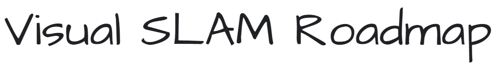

# Visual-SLAM Developer Roadmap - 2026

Visual-SLAM is a special case of '[Simultaneous Localization and Mapping](https://en.wikipedia.org/wiki/Simultaneous_localization_and_mapping)' in which a camera is used to gather exteroceptive sensory data.

Below is a set of topics you need to understand for Visual-SLAM, ranging from absolute-beginner level to getting ready to work as a Visual-SLAM engineer/researcher.

 

***

Visual-SLAM is often portrayed as a rather difficult topic - many think good C++ programming skills and a deep understanding of mathematics are necessary.

On the other hand, there are not many courses provided for beginners, especially in non-English languages.

I made this roadmap to share my thoughts and experience on studying Visual-SLAM, and hopefully beginners can get a grasp of where to start.

 

***
<h3 align="center"><strong>Purpose of these Roadmaps</strong></h3>

> The purpose of these roadmaps is to give you an idea about the general overview of Visual-SLAM, and to guide you if you are confused about where to start.

<h3 align="center"><strong>Note to Beginners</strong></h3>

> Acknowledge that SLAM has a relatively high entry barrier - it's not because it requires understanding difficult mathematics, but because it requires equipping yourself with various types of skills. Don't feel overwhelmed - you don't need to learn everything if you are just getting started. Instead, enjoy the journey itself and progress topic by topic. The result will be very rewarding.

 

***

 

## Table of Contents

| Level | Topic | Focus |
|:-----:|-------|-------|
| **1** | [Beginner](#level-1-beginner) | Math, programming, and camera/image fundamentals |
| **2** | [Getting Familiar](#level-2-getting-familiar-with-slam) | Geometry, optimization, and the anatomy of a SLAM system |
| **3** | [Monocular SLAM](#level-3-monocular-visual-slam) | Classical monocular SLAM — feature-based, direct, semi-direct, SfM, dynamic scenes |
| **4** | [RGB-D SLAM](#level-4-rgb-d-visual-slam) | Dense tracking and volumetric/surfel fusion with depth sensors |
| **5** | [Deep Learning + SLAM](#level-5-applying-deep-learning) | Learned frontends, differentiable backends, end-to-end systems, foundation-model & neural SLAM, scene understanding |
| **6** | [VIO / VINS](#level-6-vio--vins) | Fusing cameras with IMUs — filtering vs optimization |
| **7** | [Stereo SLAM](#level-7-stereo-slam) | Metric scale and depth from stereo pairs |
| **8** | [Collaborative SLAM](#level-8-collaborative--multi-robot-slam) | Multi-robot mapping, inter-robot loop closure, map merging |
| **9** | [LiDAR & Visual-LiDAR](#level-9-lidar--visual-lidar-fusion-slam) | LiDAR odometry and tight camera–LiDAR–IMU fusion |
| **10** | [Event Camera SLAM](#level-10-event-camera-slam) | Asynchronous vision for HDR and high-speed motion |
| **11** | [World Models & Spatial AI](#level-11-world-models--spatial-ai) | From SLAM maps to learned world representations |

---

## Level 1: Beginner

### Programming
- **[C++](level-02-getting-familiar/cpp.md)**: Pointer, OOP
- **[Python](level-02-getting-familiar/python.md)**
- **[Bash/Linux](level-02-getting-familiar/bash-linux.md)**: Basic terminal usage

### Mathematics
- **[Basic Probability & Statistics](level-01-beginner/basic-probability-and-statistics.md)**: Gaussian distribution, Bayes' theorem
- **[Basic Linear Algebra](level-01-beginner/basic-linear-algebra.md)**: Vectors & Matrices, Determinant, Dot & Cross product, Rank, Inverse matrix, Transpose matrix, [SVD](level-01-beginner/svd.md), Eigenvalues/Eigenvectors
- **[Logarithm & Exponential](level-01-beginner/logarithm-and-exponential.md)**
- **[Basic Calculus](level-01-beginner/basic-calculus.md)**: Differentiation, Taylor expansion

### Projective Geometry
- **[Pinhole camera model](level-01-beginner/pinhole-camera-model.md)** → Image projection
- **[Camera calibration](level-01-beginner/camera-calibration.md)**: Intrinsic/Extrinsic parameters, [Lens](level-02-getting-familiar/camera-device.md) distortion
- **[Rigid body motion](level-01-beginner/rigid-body-motion.md)**: Euler/Quaternion/Rotation Matrix, Projective space & Vanishing point, Homogeneous transformation
- **[Epipolar geometry](level-01-beginner/epipolar-geometry.md)** → Essential & Fundamental matrix
- **[Triangulation](level-01-beginner/triangulation.md)**
- **[Camera models beyond pinhole](level-01-beginner/camera-models-beyond-pinhole.md)**: Fisheye (Kannala-Brandt), double-sphere, omnidirectional; rolling-shutter awareness

### Camera Device
- [Lens](level-02-getting-familiar/camera-device.md), [Sensor](level-02-getting-familiar/camera-device.md), [Resolution/ISO/Aperture](level-02-getting-familiar/camera-device.md)

### Image Data
- Color image, Resolution, Grayscale image
- [Thresholding](level-01-beginner/thresholding.md), [Gaussian blur](level-01-beginner/gaussian-blur.md)
- **[Corner detector](level-01-beginner/corner-detector.md)**: Harris corner
- **[Edge detector](level-01-beginner/edge-detector.md)**: Sobel & Canny Edge
- [Stereo vision](level-01-beginner/stereo-vision.md), [RGB-D](level-04-rgbd-slam/depth-from-sensor.md), [Disparity](level-07-stereo-slam/disparity-vs-depth.md), [Depth](level-07-stereo-slam/disparity-vs-depth.md)

---

## Level 2: Getting Familiar with SLAM

### Programming (core)
- **[C++](level-02-getting-familiar/cpp.md)**: OOP, Modern C++, Data structures & Algorithms, Compilers, CMake/Makefile/Ninja, Design patterns, OpenCV C++
- **[C](level-02-getting-familiar/c.md)**
- **[Git/GitHub](level-02-getting-familiar/git-github.md)**
- **[OpenCV](level-02-getting-familiar/opencv.md)** (opencv-python)
- **[Python](level-02-getting-familiar/python.md)**: Deep learning, Graph plots, System scripts
- **[Bash/Linux](level-02-getting-familiar/bash-linux.md)**: ssh, CLI text editor/Vim/tmux
- **[Math libraries](level-02-getting-familiar/math-libraries.md)**: Eigen, Ceres-solver/GTSAM/g2o
- **[C++/Python interop](level-02-getting-familiar/cpp-python-interop.md)**: PyBind11, nanobind
- **[ROS/ROS2](level-02-getting-familiar/ros-ros2.md)**
- **[Docker](level-02-getting-familiar/docker.md)**

### Programming (optional — engineering skills for SLAM jobs)
- **[Concurrency](level-02-getting-familiar/concurrency.md)**: SIMD-SSE/AVX/Neon, OpenMP, CUDA
- **[Edge deployment](level-02-getting-familiar/edge-deployment.md)**: TensorRT/ONNX export of learned frontends, Jetson benchmarking
- **[Mobile](level-02-getting-familiar/mobile.md)**: Android (Java/Kotlin), iOS (Objective-C/Swift)
- **[C#](level-02-getting-familiar/csharp.md)**: Unity AR, Microsoft HoloLens
- **[CI/CD](level-02-getting-familiar/ci-cd.md)**: GitHub Actions
- **[Simulation](level-02-getting-familiar/simulation.md)**: Gazebo, Isaac Sim

### Image Processing
- **[Keypoints](level-02-getting-familiar/keypoints.md)** → Detector/Descriptor
  - [SIFT](level-02-getting-familiar/sift.md), [FAST](level-02-getting-familiar/fast.md), [ORB](level-02-getting-familiar/orb.md), [AKAZE](level-02-getting-familiar/akaze.md)
  - Deep features: [R2D2](level-05-deep-learning/r2d2.md), [SuperPoint](level-05-deep-learning/superpoint.md)
- [Image pyramid](level-02-getting-familiar/image-pyramid.md), [oFAST](level-02-getting-familiar/orb.md), [rBRIEF](level-02-getting-familiar/orb.md)

### Local Feature Matching
- [Brute-Force](level-02-getting-familiar/brute-force-matching.md), [FLANN](level-02-getting-familiar/flann.md), [Kd-Tree](level-02-getting-familiar/kd-tree.md)
- [LSH](level-02-getting-familiar/lsh.md), [Multi-probe LSH](level-02-getting-familiar/lsh.md), [HBST](level-02-getting-familiar/hbst.md)
- [SuperGlue](level-05-deep-learning/superglue.md)

### Global Feature Matching
- [Bag of Visual Words](level-02-getting-familiar/bag-of-visual-words.md), [NetVLAD](level-05-deep-learning/netvlad.md)
- [Deep image retrieval](level-02-getting-familiar/deep-image-retrieval.md), [Hierarchical localization](level-05-deep-learning/hloc.md)

### Feature Tracking
- [Optical flow](level-02-getting-familiar/optical-flow.md), [KLT Tracker](level-02-getting-familiar/klt-tracker.md)

### Multiple View Geometry
- **[2D-2D correspondence](level-02-getting-familiar/2d-2d-correspondence.md)**: [Essential/Fundamental](level-01-beginner/epipolar-geometry.md), [Homography](level-01-beginner/epipolar-geometry.md)
- **[2D-3D correspondence](level-02-getting-familiar/2d-3d-correspondence.md)**: [P3P](level-02-getting-familiar/pnp.md), [PnP](level-02-getting-familiar/pnp.md), [SVD](level-01-beginner/svd.md)
- **[3D-3D correspondence](level-02-getting-familiar/3d-3d-correspondence.md)**: [ICP](level-04-rgbd-slam/icp.md)

### Outlier Rejection
- [RANSAC](level-02-getting-familiar/ransac.md), [PROSAC](level-02-getting-familiar/prosac.md), [M-Estimator](level-02-getting-familiar/m-estimator.md), [MAXCON](level-02-getting-familiar/maxcon.md), [Convex relaxation](level-02-getting-familiar/convex-relaxation.md)
- **[Robust pose-graph optimization](level-02-getting-familiar/robust-pose-graph-optimization.md)**: Switchable constraints, Dynamic covariance scaling (DCS), Pairwise consistency maximization (PCM)

### Certifiably Optimal Algorithms

| System | Author/Year | Key Concepts |
|--------|-------------|--------------|
| [**SE-Sync**](level-02-getting-familiar/se-sync.md) | [Rosen 2019](https://arxiv.org/abs/1611.00128) | Certifiable pose graph optimization via SDP + Riemannian opt (arXiv 2016, IJRR 2019) |
| [**TEASER++**](level-02-getting-familiar/teaserpp.md) | [Yang 2020](https://arxiv.org/abs/2001.07715) | Point cloud registration, 90%+ outlier robust, TLS + Max Clique (T-RO/RSS 2020) |
| [**GNC**](level-02-getting-familiar/gnc.md) | [Yang 2020](https://arxiv.org/abs/1909.08605) | Graduated Non-Convexity, continuation from convex → robust cost |
| [**QUASAR**](level-02-getting-familiar/quasar.md) | [Yang 2019](https://arxiv.org/abs/1905.12536) | Certifiably optimal rotation search (Wahba problem with outliers), quaternion QCQP + SDP relaxation |

### Least Squares Optimization
- [Reprojection error](level-02-getting-familiar/reprojection-error.md), [Bundle adjustment](level-02-getting-familiar/bundle-adjustment.md)
- [Non-linear optimization](level-02-getting-familiar/non-linear-optimization.md), [Lie algebra](level-02-getting-familiar/lie-groups.md)
- **[Lie groups](level-02-getting-familiar/lie-groups.md)**: SO(3), SE(3)
- [Gauss-Newton](level-02-getting-familiar/gauss-newton.md), [Levenberg-Marquardt](level-02-getting-familiar/levenberg-marquardt.md)
- **[Pose graph optimization](level-02-getting-familiar/pose-graph-optimization.md)**
- **[Schur complement / Sparsity](level-02-getting-familiar/schur-complement-sparsity.md)**

### Motion Model
- **[Proprioceptive sensor](level-02-getting-familiar/proprioceptive-sensor.md)**: IMU, Wheel
- **[Odometry](level-02-getting-familiar/odometry.md)** (pose)

### Observation Model
- **[Exteroceptive sensor](level-02-getting-familiar/exteroceptive-sensor.md)**: Camera, LiDAR
- **[Landmark](level-02-getting-familiar/landmark.md)** (Map)
- [Joint optimization](level-02-getting-familiar/map-inference-as-sparse-nonlinear-least-squares.md), [MLE & MAP](level-02-getting-familiar/mle-and-map.md)

### Factor Graph Optimization
- **[Factor graph](level-02-getting-familiar/factor-graph.md)**: SLAM as a bipartite graph of variables (poses, landmarks) and factors (measurements)
- **[MAP inference as sparse nonlinear least squares](level-02-getting-familiar/map-inference-as-sparse-nonlinear-least-squares.md)**; variable elimination and the Bayes tree
- **[Incremental smoothing](level-02-getting-familiar/incremental-smoothing.md)**: iSAM / iSAM2
- **[Marginalization](level-02-getting-familiar/marginalization.md)** and fixed-lag smoothing
- Reference: [Dellaert & Kaess, *Factor Graphs for Robot Perception* (2017)](https://www.cs.cmu.edu/~kaess/pub/Dellaert17fnt.pdf); GTSAM tutorials

### Gaussian Belief Propagation

| System | Author/Year | Key Concepts |
|--------|-------------|--------------|
| [**FutureMapping 1**](level-02-getting-familiar/futuremapping-1.md) | [Davison 2018](https://arxiv.org/abs/1803.11288) | Computational structure of Spatial AI, GBP for SLAM |
| [**FutureMapping 2**](level-02-getting-familiar/futuremapping-2.md) | [Davison 2019](https://arxiv.org/abs/1910.14139) | GBP as core Spatial AI primitive, visual intro to GBP |
| [**BA on Graph Processor**](level-02-getting-familiar/ba-on-graph-processor.md) | [Ortiz 2020](https://arxiv.org/abs/2003.03134) | Bundle Adjustment on Graphcore IPU, tile-based parallelism |
| [**DANCeRS**](level-02-getting-familiar/dancers.md) | [Patwardhan 2025](https://arxiv.org/abs/2508.18153) | GBP-based distributed consensus in robot swarms |

### Mapping
- [Point cloud](level-02-getting-familiar/point-cloud.md), [Occupancy grid mapping](level-02-getting-familiar/occupancy-grid-mapping.md), [TSDF](level-04-rgbd-slam/tsdf-vs-surfel-maps.md), [Surfel](level-04-rgbd-slam/tsdf-vs-surfel-maps.md), [Voxel map](level-02-getting-familiar/voxel-map.md)

### Sensors
- **[Camera device](level-02-getting-familiar/camera-device.md)**: Wide/telecentric lens, Lens MTF, CCD/CMOS, Rolling/Global shutter, Exposure/ISO, [Stereo vision](level-01-beginner/stereo-vision.md), [RGB-D](level-04-rgbd-slam/depth-from-sensor.md), [Structured light](level-04-rgbd-slam/depth-from-sensor.md), [Active IR/ToF](level-04-rgbd-slam/depth-from-sensor.md)
- **[LiDAR](level-02-getting-familiar/lidar.md)** → [Visual-LiDAR fusion](level-09-lidar-visual-lidar-slam/lidar-visual-inertial-lvi.md)
- **[IMU](level-02-getting-familiar/imu.md)** → VIO
- **[RADAR](level-02-getting-familiar/radar.md)** → [Sensor](level-02-getting-familiar/camera-device.md) fusion, [Extended Kalman filter](level-02-getting-familiar/extended-kalman-filter.md)
- **[Sonar](level-02-getting-familiar/sonar.md)**
- **[Multi-sensor calibration](level-02-getting-familiar/multi-sensor-calibration.md)**: Camera-IMU, Camera-LiDAR ([Kalibr](https://github.com/ethz-asl/kalibr))

### Evaluation
- **[Metrics](level-02-getting-familiar/metrics.md)**: ATE (Absolute Trajectory Error), RPE (Relative Pose Error)
- **[Consistency](level-02-getting-familiar/consistency.md)**: NEES (Normalized Estimation Error Squared)
- **Datasets**: [KITTI](https://www.cvlibs.net/datasets/kitti/), [TUM RGB-D](https://cvg.cit.tum.de/data/datasets/rgbd-dataset), [EuRoC](https://projects.asl.ethz.ch/datasets/euroc-mav/), [TartanAir](https://arxiv.org/abs/2003.14338), [TUM-VI](https://arxiv.org/abs/1804.06120), [4Seasons](https://arxiv.org/abs/2009.06364), [Hilti SLAM Challenge](https://hilti-challenge.com/), [Newer College](https://arxiv.org/abs/2003.05691), [Project Aria](https://www.projectaria.com/)
- **Tools**: [evo](https://github.com/MichaelGrupp/evo) (trajectory evaluation)

---

## Level 3: Monocular Visual-SLAM

### Key Concepts
- **[VO vs SLAM](level-03-monocular-slam/vo-vs-slam.md)** — VO is local (no loop closure), SLAM includes global map + loop closure
- **[Scale ambiguity](level-03-monocular-slam/scale-ambiguity.md)** — Fundamental limitation of monocular SLAM; absolute scale is classically unrecoverable from geometry alone (learned metric-depth priors such as Metric3D or MASt3R can supply approximate scale)
- **[Covisibility graph](level-03-monocular-slam/covisibility-graph.md)** — Shared map point visibility between keyframes; core data structure in ORB-SLAM
- **[Visual Place Recognition (VPR)](level-03-monocular-slam/visual-place-recognition-vpr.md)** — Recognizing previously visited places for loop closure
- **[Self-supervised depth](level-03-monocular-slam/self-supervised-depth.md)** — Learning monocular depth without ground truth (Monodepth2, Godard 2019)

### Feature-based SLAM

| System | Author/Year | Key Concepts |
|--------|-------------|--------------|
| [Visual Odometry](level-03-monocular-slam/visual-odometry.md) | [Nistér 2004](https://ieeexplore.ieee.org/document/1315094) | Five-point essential matrix solver, RANSAC, Triangulation, VO (local-only, no loop closure) |
| [**MonoSLAM**](level-03-monocular-slam/monoslam.md) | [Davison 2007](https://ieeexplore.ieee.org/document/4160954) | **First real-time monocular SLAM**, EKF-based, single camera, sparse 3D map, probabilistic feature initialization |
| [PTAM](level-03-monocular-slam/ptam.md) | [Klein & Murray 2007](https://www.robots.ox.ac.uk/~gk/publications/KleinMurray2007ISMAR.pdf) | FAST feature, Tracking, **Frontend/Backend separation**, Parallel threads, Keyframe, Mapping, Bundle adjustment, Manual initialization |
| [Visual-SLAM why filter?](level-03-monocular-slam/visual-slam-why-filter.md) | [Strasdat 2012](https://doi.org/10.1016/j.imavis.2012.02.009) | Bundle adjustment, Scale-aware BA, Motion-only BA |
| [**ORB-SLAM**](level-03-monocular-slam/orb-slam.md) | [Mur-Artal 2015](https://arxiv.org/abs/1502.00956) | ORB keypoint, **Automatic initialization (Homography vs Fundamental selection)**, Tracking thread, Local (covisibility-based) BA + global BA on loop closure, Local mapping, Large-scale, Loop closure, Bag of Visual Words, Global optimization, Covisibility graph, **Map point management (culling, merging)** |
| [Pop-up SLAM](level-03-monocular-slam/pop-up-slam.md) | [Yang 2016](https://arxiv.org/abs/1703.07334) | Line/Plane features |
| [PL-SLAM](level-03-monocular-slam/pl-slam.md) | [Pumarola 2017](https://www.albertpumarola.com/research/pl-slam/index.html) | Point/Line features |
| [**ORB-SLAM2**](level-03-monocular-slam/orb-slam2.md) | [Mur-Artal 2017](https://arxiv.org/abs/1610.06475) | → Stereo SLAM, → RGB-D SLAM |
| [CubeSLAM](level-03-monocular-slam/cubeslam.md) | [Yang 2019](https://arxiv.org/abs/1806.00557) | Monocular 3D cuboid detection + SLAM, 9-DoF object representation |
| [OpenVSLAM](level-03-monocular-slam/openvslam.md) | [Sumikura 2019](https://arxiv.org/abs/1910.01122) | ORB-based SLAM framework, perspective/fisheye/equirectangular camera models, map save/load + localization mode |
| [**Stella-VSLAM**](level-03-monocular-slam/stella-vslam.md) | [Community 2021](https://github.com/stella-cv/stella_vslam) | OpenVSLAM successor, license reboot (→ also in Level 7) |
| [UcoSLAM](level-03-monocular-slam/ucoslam.md) | [Muñoz-Salinas 2019](https://arxiv.org/abs/1902.03729) | Fiducial markers |
| [DeepFusion](level-03-monocular-slam/deepfusion.md) | [Laidlow 2019](https://arxiv.org/abs/2207.12244) | Dense monocular reconstruction, semi-dense MVS + CNN depth/gradient predictions, probabilistic fusion with learned uncertainties |
| [**ORB-SLAM3**](level-03-monocular-slam/orb-slam3.md) | [Campos 2020](https://arxiv.org/abs/2007.11898) | Monocular + Stereo + VIO, Multi-map, IMU integration |
| [DXSLAM](level-03-monocular-slam/dxslam.md) | [Li 2020](https://arxiv.org/abs/2008.05416) | Deep features for SLAM |
| [**PyCuVSLAM**](level-03-monocular-slam/pycuvslam.md) | [NVIDIA 2025](https://github.com/NVlabs/pycuvslam) | Python + CUDA GPU-accelerated VSLAM toolkit (cuVSLAM wrapper; stereo/multi-camera VIO) |

### Direct SLAM

| System | Author/Year | Key Concepts |
|--------|-------------|--------------|
| [**DTAM**](level-03-monocular-slam/dtam.md) | [Newcombe 2011](https://ieeexplore.ieee.org/document/6126513) | Dense mapping, Keyframe mapping, GPGPU |
| [**LSD-SLAM**](level-03-monocular-slam/lsd-slam.md) | [Engel 2014](https://cvg.cit.tum.de/research/vslam/lsdslam) | Photometric error minimization, High gradient pixels/edges, Large scale, Loop closure, Pose graph optimization |
| [**DSO**](level-03-monocular-slam/dso.md) | [Engel 2016](https://arxiv.org/abs/1607.02565) | Photometric bundle adjustment, Sliding window BA, No loop closure/global optimization |
| [**LDSO**](level-03-monocular-slam/ldso.md) | [Gao 2018](https://arxiv.org/abs/1808.01111) | DSO + Loop closure (BoW-based), addresses DSO's main weakness |
| [CNN-SLAM](level-03-monocular-slam/cnn-slam.md) | [Tateno 2017](https://arxiv.org/abs/1704.03489) | Depth from LSD-SLAM + deep depth, Semantic label |
| [DVSO](level-03-monocular-slam/dvso.md) | [Yang 2018](https://arxiv.org/abs/1807.02570) | Deep single image depth estimation, StackNet |
| [D3VO](level-03-monocular-slam/d3vo.md) | [Yang 2020](https://arxiv.org/abs/2003.01060) | Deep single image depth estimation, Deep pose, Deep aleatoric uncertainty |

### Semi-direct (Hybrid)

| System | Author/Year | Key Concepts |
|--------|-------------|--------------|
| [SVO](level-03-monocular-slam/svo.md) | [Forster 2014](https://ieeexplore.ieee.org/document/6906584) | FAST feature detection, sparse direct image alignment, depth filters |
| [SVO2](level-03-monocular-slam/svo2.md) | [Forster 2017](https://rpg.ifi.uzh.ch/svo2.html) | Multi-camera/Fisheye, Probabilistic depth estimation, Direct method convergence, Sparse method, Bundle adjustment |
| [**Stereo DSO**](level-07-stereo-slam/stereo-dso.md) | [Wang 2017](https://arxiv.org/abs/1708.07878) | → Stereo SLAM |
| [VI-DSO](level-06-vio-vins/vi-dso.md) | [von Stumberg 2018](https://arxiv.org/abs/1804.05625) | → VIO/VINS |

### SfM Tools

| System | Author/Year | Key Concepts |
|--------|-------------|--------------|
| [**COLMAP**](level-03-monocular-slam/colmap.md) | [Schönberger 2016](https://colmap.github.io/) | De-facto standard incremental SfM + MVS pipeline (C++/CUDA, pycolmap bindings) |
| [**GLOMAP**](level-03-monocular-slam/glomap.md) | [Pan 2024](https://arxiv.org/abs/2407.20219) | Global SfM revisited — COLMAP-compatible, much faster mapping |
| [**InstantSfM**](level-03-monocular-slam/instantsfm.md) | [Zhong 2025](https://arxiv.org/abs/2510.13310) | GPU-native sparse-aware SfM pipeline, large speedups over COLMAP |

### Dynamic Environment SLAM

| System | Author/Year | Key Concepts |
|--------|-------------|--------------|
| [**DynaSLAM**](level-03-monocular-slam/dynaslam.md) | [Bescós 2018](https://arxiv.org/abs/1806.05620) | Mask R-CNN dynamic-object removal + background inpainting, ORB-SLAM2-based |
| [DS-SLAM](level-03-monocular-slam/ds-slam.md) | [Yu 2018](https://arxiv.org/abs/1809.08379) | Semantic segmentation (SegNet) + motion consistency check |
| [MaskFusion](level-03-monocular-slam/maskfusion.md) | [Rünz 2018](https://arxiv.org/abs/1804.09194) | RGB-D recognition, tracking and reconstruction of multiple moving objects |
| [MID-Fusion](level-03-monocular-slam/mid-fusion.md) | [Xu 2019](https://arxiv.org/abs/1812.07976) | Octree-based object-level multi-instance dynamic RGB-D SLAM |
| [**VDO-SLAM**](level-03-monocular-slam/vdo-slam.md) | [Zhang 2020](https://arxiv.org/abs/2005.11052) | Dynamic object-aware SLAM, joint camera + object motion estimation |
| [DynaSLAM II](level-03-monocular-slam/dynaslam-ii.md) | [Bescós 2021](https://arxiv.org/abs/2010.07820) | Tightly-coupled multi-object tracking and SLAM |
| [**MonST3R**](level-03-monocular-slam/monst3r.md) | [Zhang 2024](https://arxiv.org/abs/2410.03825) | DUSt3R-family pointmap estimation in the presence of motion |

---

## Level 4: RGB-D Visual-SLAM

### Key Concepts
- **[Depth from sensor](level-04-rgbd-slam/depth-from-sensor.md)** — Structured light vs Active IR (ToF); metric scale for free, but range/material limitations
- **[Frame-to-model tracking](level-04-rgbd-slam/frame-to-model-tracking.md)** — Aligning each frame against the accumulated model ([ICP](level-04-rgbd-slam/icp.md)) instead of frame-to-frame
- **[TSDF vs Surfel maps](level-04-rgbd-slam/tsdf-vs-surfel-maps.md)** — Volumetric signed-distance fusion (KinectFusion) vs point-based surfel fusion (ElasticFusion)

### RGB-D Camera Devices
- Intel RealSense D series
- Orbbec Femto series (Azure Kinect successor), Orbbec Astra
- Luxonis OAK-D
- Legacy (discontinued): Microsoft Kinect v1/v2, Azure Kinect DK, Occipital Structure Core

### GPGPU Programming
- [CUDA, OpenGL GLSL](level-04-rgbd-slam/gpgpu-programming.md)

### Systems

| System | Author/Year | Key Concepts |
|--------|-------------|--------------|
| [ICP](level-04-rgbd-slam/icp.md) | [Besl & McKay 1992](https://ieeexplore.ieee.org/document/121791) | Iterative Closest Point, closest-point correspondence, closed-form rigid transform, local convergence (needs initialization), foundation of 3D-3D registration |
| [**DTAM**](level-03-monocular-slam/dtam.md) | Newcombe 2011 | → see Level 3 Direct SLAM |
| [**KinectFusion**](level-04-rgbd-slam/kinectfusion.md) | [Newcombe 2011](https://ieeexplore.ieee.org/document/6162880) | GPGPU, Tracking (project depth → 3D, surface normal, coarse-to-fine ICP), Mapping (volumetric integration, TSDF), Robust to small scene changes, Cannot model deformation, Map growth cubic, Room-size only |
| [Double Window Optimisation](level-04-rgbd-slam/double-window-optimisation.md) | [Strasdat 2011](https://ieeexplore.ieee.org/document/6126517) | Inner window (local BA) + outer window (pose graph), covisibility graph, constant-time optimization |
| [Kintinuous](level-04-rgbd-slam/kintinuous.md) | [Whelan 2012](https://ieeexplore.ieee.org/document/6907054) | Volume shift, Geometric, Photometric, dBoW+SURF, Optimization, Loop closure |
| [RGBD-SLAM-V2](level-04-rgbd-slam/rgbd-slam-v2.md) | [Endres 2013](https://felixendres.github.io/rgbdslam_v2/) | Tracking (color image, visual features, depth image, point cloud, transformation), Mapping (OctoMap 2013) |
| [SLAM++](level-04-rgbd-slam/slampp.md) | [Salas-Moreno 2013](https://ieeexplore.ieee.org/document/6619022) | Object-oriented SLAM |
| [DVO](level-04-rgbd-slam/dvo.md) | [Kerl 2013](https://vision.in.tum.de/data/software/dvo) | Keyframe, Depth, Direct method, Optimization, Loop closure |
| [**RTAB-Map**](level-04-rgbd-slam/rtab-map.md) | [Labbé 2014](https://introlab.github.io/rtabmap/) | Loop closure, Map merge, Multi-session memory management |
| [MRS-Map](level-04-rgbd-slam/mrs-map.md) | [Stückler 2014](https://doi.org/10.1016/j.jvcir.2013.02.008) | Multi-resolution surfel maps in an octree, shape + color statistics per surfel, noise-aware RGB-D registration, real-time on CPU |
| [**ElasticFusion**](level-04-rgbd-slam/elasticfusion.md) | [Whelan 2015](https://ieeexplore.ieee.org/document/7274882) | Active: frame-to-model tracking (photometric + geometric), joint optimization, fused surfel-based model reconstruction · Inactive: local loop closure (model-to-model local surface, submodel separation), global loop closure (randomised fern encoding, non-rigid space deformation) |
| [DynamicFusion](level-04-rgbd-slam/dynamicfusion.md) | [Newcombe 2015](https://ieeexplore.ieee.org/document/7298631) | 6D motion field, Deformable scene |
| [**ORB-SLAM2**](level-03-monocular-slam/orb-slam2.md) (RGB-D mode) | Mur-Artal 2017 | Bundle adjustment, Sparse reconstruction (→ also in Level 3) |
| [**BundleFusion**](level-04-rgbd-slam/bundlefusion.md) | [Dai 2016](https://arxiv.org/abs/1604.01093) | Local-to-global optimization, Sparse RGB feature, Coarse global pose estimation, Fine pose refinement (geometric + photometric) |
| [SemanticFusion](level-04-rgbd-slam/semanticfusion.md) | [McCormac 2016](https://arxiv.org/abs/1609.05130) | Deep Learning CNN, Deep Semantic SLAM |
| [InfiniTAM v3](level-04-rgbd-slam/infinitam-v3.md) | [Prisacariu 2017](https://arxiv.org/abs/1708.00783) | Tracking (scene raycast, depth image, RGB image), Relocalization (random ferns), Mapping (TSDF reconstruction, voxel hashing, surfel reconstruction) |
| [Fusion++](level-04-rgbd-slam/fusionpp.md) | [McCormac & Clark 2018](https://arxiv.org/abs/1808.08378) | Deep Learning CNN, Mask-RCNN instance segmentation, Object-level SLAM, No prior, Object-level TSDF reconstruction |
| [PointFusion / DenseFusion](level-04-rgbd-slam/pointfusion-densefusion.md) | [Xu 2018](https://arxiv.org/abs/1711.10871) / [Wang 2019](https://arxiv.org/abs/1901.04780) | RGB-D object 6-DoF pose estimation, point cloud + image feature fusion (object frontend for object-level SLAM) |
| [BAD SLAM](level-04-rgbd-slam/bad-slam.md) | [Schöps 2019](https://openaccess.thecvf.com/content_CVPR_2019/html/Schops_BAD_SLAM_Bundle_Adjusted_Direct_RGB-D_SLAM_CVPR_2019_paper.html) | Direct RGB-D bundle adjustment, surfel map, real-time GPU BA, ETH3D benchmark |
| [**RTAB-Map**](level-04-rgbd-slam/rtab-map.md) (RGB-D / LiDAR) | [Labbé 2019](https://doi.org/10.1002/rob.21831) | Multi-sensor RGB-D/LiDAR support, light-source detection (2016) |
| [**MoreFusion**](level-04-rgbd-slam/morefusion.md) | [Wada 2020](https://arxiv.org/abs/2004.04336) | DL instance segmentation, Object-level volumetric fusion, Volumetric pose prediction, 3D scene reconstruction, Collision-based refinement, Semantic SLAM, Object pose estimation, CAD object fitting |
| [**NodeSLAM**](level-05-deep-learning/nodeslam.md) | Sucar 2020 | Occupancy VAE, Object-level SLAM (→ also in Level 5 Latent Representation) |
| [**DSP-SLAM**](level-04-rgbd-slam/dsp-slam.md) | [Wang (UCL) 2021](https://arxiv.org/abs/2108.09481) | DeepSDF shape prior + ORB-SLAM2, object-level dense reconstruction (mono/stereo/LiDAR) |

---

## Level 5: Applying Deep Learning

### Key Concepts
- **[Learned vs hand-crafted](level-05-deep-learning/learned-vs-hand-crafted.md)** — Replacing individual classical modules (features, depth, matching) with networks vs end-to-end learning
- **[Differentiability](level-05-deep-learning/differentiability.md)** — Making classical optimization (RANSAC, BA) differentiable so it can be trained through
- **[Foundation models](level-05-deep-learning/foundation-models.md)** — Large pretrained models (CLIP, SAM, DUSt3R-family) as reusable perception backbones

> Level 5 is organized into five pillars:
> **A. Frontend** — learned perception components replacing hand-crafted modules
> **B. Backend** — learned/certifiable optimization replacing classical solvers
> **C. Systems** — end-to-end deep VO/SLAM pipelines
> **D. Scene Understanding** — semantic, language, and relational reasoning on SLAM maps
> **E. Foundation-Model & Neural SLAM** — pointmap transformers, NeRF- and 3DGS-based dense SLAM systems

### A. Deep Frontend — Perception

#### Feature Detection & Matching

| System | Author/Year | Key Concepts |
|--------|-------------|--------------|
| [**NetVLAD**](level-05-deep-learning/netvlad.md) | [Arandjelović 2016](https://arxiv.org/abs/1511.07247) | VLAD, place recognition |
| [**SuperPoint**](level-05-deep-learning/superpoint.md) | [DeTone 2017](https://arxiv.org/abs/1712.07629) | Homographic Adaptation, Self-supervised, VGG encoder + detector/descriptor heads |
| [HardNet](level-05-deep-learning/hardnet.md) | [Mishchuk 2017](https://arxiv.org/abs/1705.10872) | Learned local descriptor |
| [**R2D2**](level-05-deep-learning/r2d2.md) | [Revaud 2019](https://arxiv.org/abs/1906.06195) | Repeatable + Reliable detector/descriptor, explicit repeatability/reliability maps |
| [KeyNet](level-05-deep-learning/keynet.md) | [Barroso-Laguna 2019](https://arxiv.org/abs/1904.00889) | Learned keypoint detector |
| [**HF-Net**](level-05-deep-learning/hf-net.md) | [Sarlin 2019](https://arxiv.org/abs/1812.03506) | Global feature, Local feature, Visual localization |
| [**SuperGlue**](level-05-deep-learning/superglue.md) | [Sarlin 2020](https://arxiv.org/abs/1911.11763) | Self/Cross-attention GNN, Sinkhorn optimal assignment, dustbin for outliers |
| [**DISK**](level-05-deep-learning/disk.md) | [Tyszkiewicz 2020](https://arxiv.org/abs/2006.13566) | Policy gradient (RL) training, match success/failure as reward |
| [Patch NetVLAD](level-05-deep-learning/patch-netvlad.md) | [Hausler 2021](https://arxiv.org/abs/2103.01486) | Multi-scale patch-level VLAD |
| [**LoFTR**](level-05-deep-learning/loftr.md) | [Sun 2021](https://arxiv.org/abs/2104.00680) | Detector-free, Transformer coarse-to-fine dense matching |
| [**LightGlue**](level-05-deep-learning/lightglue.md) | [Lindenberger 2023](https://arxiv.org/abs/2306.13643) | Adaptive depth/width, 5-10× faster than SuperGlue |
| [**XFeat**](level-05-deep-learning/xfeat.md) | [Potje 2024](https://arxiv.org/abs/2404.19174) | 0.3M params, 1400 FPS (RTX 4090), 64-dim descriptor, embedded-friendly |
| [**RoMa**](level-05-deep-learning/roma.md) | [Edstedt 2024](https://arxiv.org/abs/2305.15404) | DINOv2 foundation feature + coarse-to-fine dense matching |
| [**DeDoDe**](level-05-deep-learning/dedode.md) | [Edstedt 2024](https://arxiv.org/abs/2308.08479) | Joint detect-and-describe in one stage |
| [**RoMa v2**](level-05-deep-learning/roma-v2.md) | [Edstedt 2025](https://arxiv.org/abs/2511.15706) | Harder-better-faster-denser dense feature matching |

#### Depth Estimation

| System | Author/Year | Key Concepts |
|--------|-------------|--------------|
| [MonoDepth](level-05-deep-learning/monodepth.md) | [Godard 2016](https://arxiv.org/abs/1609.03677) | Left-Right photometric consistency, self-supervised |
| [**MiDaS**](level-05-deep-learning/midas.md) | [Ranftl 2020](https://arxiv.org/abs/1907.01341) | Multi-dataset mixing, scale-and-shift invariant loss, relative depth |
| [**DPT**](level-05-deep-learning/dpt.md) | [Ranftl 2021](https://arxiv.org/abs/2103.13413) | Dense Prediction Transformer (ViT backbone), global context |
| [**ZoeDepth**](level-05-deep-learning/zoedepth.md) | [Bhat 2023](https://arxiv.org/abs/2302.12288) | Zero-shot metric depth, Metric Bins Module |
| [**Metric3D**](level-05-deep-learning/metric3d.md) | [Yin 2023](https://arxiv.org/abs/2307.10984) | Camera intrinsic-conditioned metric depth, Canonical Camera Space |
| [**Depth Anything**](level-05-deep-learning/depth-anything.md) | [Yang 2024](https://arxiv.org/abs/2401.10891) | 62M images, foundation model for monocular depth |
| [**Depth Anything V2**](level-05-deep-learning/depth-anything-v2.md) | [Yang 2024](https://arxiv.org/abs/2406.09414) | Improved with synthetic data, better edge preservation |
| [**Depth Anything 3**](level-05-deep-learning/depth-anything-3.md) | [Lin 2025](https://arxiv.org/abs/2511.10647) | Any-view geometry from arbitrary inputs, depth-ray prediction target, single plain transformer (DINOv2), teacher-student training |
| [**Marigold**](level-05-deep-learning/marigold.md) | [Ke 2024](https://arxiv.org/abs/2312.02145) | Stable Diffusion for depth, fine detail, uncertainty via sampling |
| [**Align3R**](level-05-deep-learning/align3r.md) | [Lu 2025](https://arxiv.org/abs/2412.03079) | Video temporal consistency, DUSt3R-based, CVPR 2025 Highlight |
| [**Masked Depth Modeling (LingBot-Depth)**](level-05-deep-learning/masked-depth-modeling-lingbot-depth.md) | [Tan 2026](https://arxiv.org/abs/2601.17895) | Fixes RGB-D failures on glass/mirrors/metal |

#### Optical Flow & Scene Flow

| System | Author/Year | Key Concepts |
|--------|-------------|--------------|
| [**FlowNet**](level-05-deep-learning/flownet.md) | [Dosovitskiy 2015](https://arxiv.org/abs/1504.06852) | First end-to-end deep optical flow (SimpleNet / CorrNet) |
| [**FlowNet 2.0**](level-05-deep-learning/flownet-2-0.md) | [Ilg 2017](https://arxiv.org/abs/1612.01925) | Stacked networks, classical-level accuracy |
| [**PWC-Net**](level-05-deep-learning/pwc-net.md) | [Sun 2018](https://arxiv.org/abs/1709.02371) | Pyramid-Warping-Cost volume, coarse-to-fine, 8.4M params |
| [**FlowNet3D**](level-05-deep-learning/flownet3d.md) | [Liu 2019](https://arxiv.org/abs/1806.01411) | Point cloud scene flow, PointNet++ based |
| [**RAFT**](level-05-deep-learning/raft.md) | [Teed 2020](https://arxiv.org/abs/2003.12039) | All-Pairs Correlation + iterative ConvGRU update, **ECCV Best Paper** |
| [**RAFT-3D**](level-05-deep-learning/raft-3d.md) | [Teed 2021](https://arxiv.org/abs/2012.00726) | Scene flow (3D motion) from RAFT |
| [**FlowFormer**](level-05-deep-learning/flowformer.md) | [Huang 2022](https://arxiv.org/abs/2203.16194) | Transformer on cost volume tokens, global context |
| [**SEA-RAFT**](level-05-deep-learning/sea-raft.md) | [Wang 2024](https://arxiv.org/abs/2405.14793) | Efficient RAFT variant for real-time |

#### Camera Pose Regression & Relocalization

| System | Author/Year | Key Concepts |
|--------|-------------|--------------|
| [**PoseNet**](level-05-deep-learning/posenet.md) | [Kendall 2015](https://arxiv.org/abs/1505.07427) | CNN-based 6-DoF pose regression (APR), GoogLeNet backbone |
| [**DSAC**](level-05-deep-learning/dsac.md) | [Brachmann 2017](https://arxiv.org/abs/1611.05705) | Differentiable RANSAC, Scene Coordinate Regression (SCR) |
| [**DSAC++**](level-05-deep-learning/dsacpp.md) | [Brachmann 2018](https://arxiv.org/abs/1711.10228) | Self-supervision, RGB-D support |
| [CNN Pose Regression Limitations](level-05-deep-learning/cnn-pose-regression-limitations.md) | [Sattler 2019](https://arxiv.org/abs/1903.07504) | Pose regression ≈ image retrieval performance |
| [LM-Reloc](level-05-deep-learning/lm-reloc.md) | [von Stumberg 2020](https://arxiv.org/abs/2010.06323) | Deep direct relocalization |
| [**DSAC\***](level-05-deep-learning/dsac-star.md) | [Brachmann 2021](https://arxiv.org/abs/2002.12324) | Visual relocalization from RGB/RGB-D, improved learning stability (TPAMI) |
| [**ACE**](level-05-deep-learning/ace.md) | [Brachmann 2023](https://arxiv.org/abs/2305.14059) | Accelerated Coordinate Encoding, 5-min training per scene |
| [**ACE Zero**](level-05-deep-learning/ace-zero.md) | [Brachmann 2024](https://arxiv.org/abs/2404.14351) | Zero-shot SCR, no pre-built 3D map needed |
| [**ACE-G**](level-05-deep-learning/ace-g.md) | [Bruns 2025](https://arxiv.org/abs/2510.11605) | Generalizable SCR via query pretraining, new scenes without fine-tuning |
| [**ACE-SLAM**](level-05-deep-learning/ace-slam.md) | [Alzugaray 2025](https://arxiv.org/abs/2512.14032) | Neural implicit real-time SLAM, network weights = map |
| [**hloc**](level-05-deep-learning/hloc.md) | [Sarlin 2019](https://github.com/cvg/Hierarchical-Localization) | Toolbox implementing HF-Net's hierarchical localization: coarse (NetVLAD) → fine (SuperGlue) |

#### Object Detection & Segmentation for SLAM

| System | Author/Year | Key Concepts |
|--------|-------------|--------------|
| [**YOLO**](level-05-deep-learning/yolo.md) (v1→v11) | [Redmon 2016→2024](https://arxiv.org/abs/1506.02640) | Real-time object detection, Ultralytics ecosystem |
| [**DETR**](level-05-deep-learning/detr.md) | [Carion 2020](https://arxiv.org/abs/2005.12872) | Transformer detection, anchor-free, no NMS |
| [**RT-DETR**](level-05-deep-learning/rt-detr.md) | [Zhao (Baidu) 2023](https://arxiv.org/abs/2304.08069) | Real-time DETR, YOLO-speed + Transformer quality |
| [**RF-DETR**](level-05-deep-learning/rf-detr.md) | [Robinson 2025](https://arxiv.org/abs/2511.09554) | Weight-sharing NAS over DETRs, accuracy-latency Pareto tuning, first real-time detector past 60 AP on COCO |
| [**SAM**](level-05-deep-learning/sam.md) | [Kirillov 2023](https://arxiv.org/abs/2304.02643) | Segment Anything, prompt-based, Foundation Model |
| [**SAM 2**](level-05-deep-learning/sam-2.md) | [Meta 2024](https://arxiv.org/abs/2408.00714) | Video segmentation, Memory Attention, temporal consistency |
| [**SAM 3**](level-05-deep-learning/sam-3.md) | [Carion 2025](https://arxiv.org/abs/2511.16719) | Promptable concept segmentation (noun-phrase / exemplar prompts), presence head, detector + memory-based video tracker |
| [**Grounding DINO**](level-05-deep-learning/grounding-dino.md) | [Liu 2023](https://arxiv.org/abs/2303.05499) | Text-prompted detection → SAM pipeline (Grounded SAM) |
| [**Open-YOLO 3D**](level-05-deep-learning/open-yolo-3d.md) | [Boudjoghra 2024](https://arxiv.org/abs/2406.02548) | 2D open-vocab detection → 3D instance seg, 16× faster |

### B. Deep Backend — Optimization

#### Differentiable Bundle Adjustment

| System | Author/Year | Key Concepts |
|--------|-------------|--------------|
| [**BA-Net**](level-05-deep-learning/ba-net.md) | [Tang 2019](https://arxiv.org/abs/1806.04807) | FPN + differentiable LM layer, end-to-end SfM (ICLR) |
| [**DROID-SLAM**](level-05-deep-learning/droid-slam.md) | [Teed 2021](https://arxiv.org/abs/2108.10869) | Dense optical flow + differentiable dense BA, all-pixels reprojection |
| [**DPVO**](level-05-deep-learning/dpvo.md) | [Teed 2023](https://arxiv.org/abs/2208.04726) | Patch-based DROID-SLAM, 30+ FPS real-time |
| [**Theseus**](level-05-deep-learning/theseus.md) | [Pineda (Meta) 2022](https://arxiv.org/abs/2207.09442) | Differentiable nonlinear optimization library (PyTorch) |
| [**Lietorch**](level-05-deep-learning/lietorch.md) | [Teed 2021](https://github.com/princeton-vl/lietorch) | Lie group operations for PyTorch (SE(3)/SO(3)) |

### C. End-to-End Deep VO / SLAM Systems

#### Self-supervised & Learned VO

| System | Author/Year | Key Concepts |
|--------|-------------|--------------|
| [DeepVO](level-05-deep-learning/deepvo.md) | [Wang 2017](https://arxiv.org/abs/1709.08429) | Supervised learning |
| [SfM-Learner](level-05-deep-learning/sfm-learner.md) | [Zhou 2017](https://arxiv.org/abs/1704.07813) | Unsupervised, deep depth + deep pose |
| [DeMoN](level-05-deep-learning/demon.md) | [Ummenhofer 2017](https://arxiv.org/abs/1612.02401) | Depth + Motion from two frames, encoder-decoder |
| [UndeepVO](level-05-deep-learning/undeepvo.md) | [Li 2018](https://arxiv.org/abs/1709.06841) | Stereo self-supervised, absolute scale recovery |
| [DeepTAM](level-05-deep-learning/deeptam.md) | [Zhou 2018](https://arxiv.org/abs/1808.01900) | Deep tracking and mapping, cost volume based |
| [DeepV2D](level-05-deep-learning/deepv2d.md) | [Teed 2018](https://arxiv.org/abs/1812.04605) | Iterative depth from video, differentiable geometry layers |
| [Depth from Videos in the Wild](level-05-deep-learning/depth-from-videos-in-the-wild.md) | [Gordon 2019](https://arxiv.org/abs/1904.04998) | Unconstrained video depth, learned camera intrinsics |
| [Neural Ray Surfaces](level-05-deep-learning/neural-ray-surfaces.md) | [Vasiljevic 2020](https://arxiv.org/abs/2008.06630) | Learned ray surface model, non-pinhole cameras |
| [GradSLAM](level-05-deep-learning/gradslam.md) | [Murthy 2020](https://arxiv.org/abs/1910.10672) | Differentiable SLAM framework (PyTorch, supports multiple SLAM backends) |
| [DeepSLAM](level-05-deep-learning/deepslam.md) | [Li 2020](https://ieeexplore.ieee.org/document/9047170) | TrackingNet, MappingNet, LoopNet |
| [MonoRec](level-05-deep-learning/monorec.md) | [Wimbauer 2021](https://arxiv.org/abs/2011.11814) | Self-supervised monocular 3D reconstruction, moving objects |
| [TANDEM](level-05-deep-learning/tandem.md) | [Koestler 2021](https://arxiv.org/abs/2111.07418) | Real-time tracking + dense mapping via MVS depth, DSO-based |

#### Learning-based SLAM Systems

| System | Author/Year | Key Concepts |
|--------|-------------|--------------|
| [**DROID-SLAM**](level-05-deep-learning/droid-slam.md) | [Teed 2021](https://arxiv.org/abs/2108.10869) | Differentiable BA, dense optical flow, end-to-end learned |
| [TartanVO](level-05-deep-learning/tartanvo.md) | [Wang 2021](https://arxiv.org/abs/2011.00359) | Generalizable visual odometry |
| [**DPV-SLAM**](level-05-deep-learning/dpv-slam.md) | [Lipson 2024](https://arxiv.org/abs/2408.01654) | DPVO + loop closure, full SLAM (ECCV 2024) |
| [MAC-VO](level-05-deep-learning/mac-vo.md) | [Qiu 2024](https://arxiv.org/abs/2409.09479) | Learning-based VO, metric-aware |
| [**VoT**](level-05-deep-learning/vot.md) | [Yugay 2025](https://arxiv.org/abs/2510.03348) | Visual Odometry with Transformers (later retitled FVO) |

#### Latent Representation SLAM

| System | Author/Year | Key Concepts |
|--------|-------------|--------------|
| [**CodeSLAM**](level-05-deep-learning/codeslam.md) | [Bloesch 2018](https://arxiv.org/abs/1804.00874) | Depth as 128-dim latent code, photometric BA on codes + poses |
| [**SceneCode**](level-05-deep-learning/scenecode.md) | [Zhi 2019](https://arxiv.org/abs/1903.06482) | Depth + semantic in single latent code, cross-modal constraints |
| [**DeepFactors**](level-05-deep-learning/deepfactors.md) | [Czarnowski 2020](https://arxiv.org/abs/2001.05049) | Probabilistic depth codes + factor graph, GPU 30+ FPS |
| [**NodeSLAM**](level-05-deep-learning/nodeslam.md) | [Sucar 2020](https://arxiv.org/abs/2004.04485) | Object-level DeepSDF codes, occupancy VAE per object |
| [**CodeMapping**](level-05-deep-learning/codemapping.md) | [Matsuki 2021](https://arxiv.org/abs/2107.08994) | Sparse SLAM + learned dense mapping, hybrid approach |

#### Neural Rendering (reference)

> NeRF/3DGS-based SLAM systems → see **Pillar E below**

| System | Author/Year | Key Concepts |
|--------|-------------|--------------|
| [**NeRF**](level-05-deep-learning/nerf.md) | [Mildenhall 2020](https://arxiv.org/abs/2003.08934) | Neural Radiance Fields, novel view synthesis (foundational) |
| [**DIFIX3D+**](level-05-deep-learning/difix3d.md) | [Wu 2025](https://arxiv.org/abs/2503.01774) | Single-step diffusion for 3D reconstruction artifact removal (post-processing) |

### D. Scene Understanding

#### Benchmarks & Foundations

| System | Author/Year | Key Concepts |
|--------|-------------|--------------|
| [**EFM3D**](level-05-deep-learning/efm3d.md) | [Straub (Meta) 2024](https://arxiv.org/abs/2406.10224) | Egocentric Foundation Model 3D benchmark, depth/surface/semantic from ego-video |

#### 3D Scene Graph

| System | Author/Year | Key Concepts |
|--------|-------------|--------------|
| [Kimera / 3D Dynamic Scene Graph](level-05-deep-learning/kimera-3d-dynamic-scene-graph.md) | [Rosinol 2020](https://arxiv.org/abs/2002.06289) | Kimera-VIO, Kimera-Mesher, Kimera-PGMO, Kimera-Semantics, Kimera-DSG (stereo/mono visual-inertial pipeline) |
| [**Hydra**](level-05-deep-learning/hydra.md) | [Hughes (MIT SPARK) 2022](https://arxiv.org/abs/2201.13360) | Real-time hierarchical Scene Graph (mesh→objects→places→rooms→buildings) |
| [**Hydra-Multi**](level-05-deep-learning/hydra-multi.md) | [Chang 2023](https://arxiv.org/abs/2304.13487) | Distributed multi-robot 3D Scene Graph |
| [**Clio**](level-05-deep-learning/clio.md) | [Maggio (MIT SPARK) 2024](https://arxiv.org/abs/2404.13696) | Open-set task-driven Scene Graph, CLIP embeddings per node |
| [**Khronos**](level-05-deep-learning/khronos.md) | [Schmid (MIT SPARK) 2024](https://arxiv.org/abs/2402.13817) | Spatio-temporal Scene Graph, dynamic object history tracking |
| [**ConceptGraphs**](level-05-deep-learning/conceptgraphs.md) | [Gu 2023](https://arxiv.org/abs/2309.16650) | Open-vocabulary 3D Scene Graph, SAM + CLIP + LLM relations |

---

#### Semantic / Language-Grounded SLAM

| System | Author/Year | Key Concepts |
|--------|-------------|--------------|
| [**ConceptFusion**](level-05-deep-learning/conceptfusion.md) | [Jatavallabhula (MIT) 2023](https://arxiv.org/abs/2302.07241) | CLIP features fused into 3D map, open-vocabulary language queries |
| [**LERF**](level-05-deep-learning/lerf.md) | [Kerr 2023](https://arxiv.org/abs/2303.09553) | Language Embedded Radiance Fields, DINO multi-scale, NeRF + CLIP |
| [**OpenScene**](level-05-deep-learning/openscene.md) | [Peng (ETH) 2023](https://arxiv.org/abs/2211.15654) | Language features back-projected to 3D point clouds |
| [**SpatialLM**](level-05-deep-learning/spatiallm.md) | [Mao 2025](https://github.com/manycore-research/SpatialLM) | Point cloud → LLM, structured indoor modeling as Python scripts |

> Also see: [**LEGS**](https://arxiv.org/abs/2409.18108), [**OpenGS-SLAM**](https://arxiv.org/abs/2503.01646) (Pillar E above); [**Open-YOLO 3D**](https://arxiv.org/abs/2406.02548) (Level 5 Object Detection)

### E. Foundation-Model & Neural-Representation SLAM

#### Foundation-Model SLAM

| System | Author/Year | Key Concepts |
|--------|-------------|--------------|
| [**DUSt3R**](level-05-deep-learning/dust3r.md) | [Wang 2024](https://arxiv.org/abs/2312.14132) | Pointmap regression from image pairs, no calibration needed |
| [**MASt3R**](level-05-deep-learning/mast3r.md) | [Leroy 2024](https://arxiv.org/abs/2406.09756) | DUSt3R + local feature matching |
| [**MASt3R-SLAM**](level-05-deep-learning/mast3r-slam.md) | [Murai 2024](https://arxiv.org/abs/2412.12392) | Real-time dense SLAM from MASt3R priors |
| [**VGGT**](level-05-deep-learning/vggt.md) | [Wang (Meta) 2025](https://arxiv.org/abs/2503.11651) | Feed-forward inference of poses, depths, pointmaps, tracks from N views (**CVPR 2025 Best Paper**) |
| [**VGGT-SLAM**](level-05-deep-learning/vggt-slam.md) | [Maggio 2025](https://arxiv.org/abs/2505.12549) | Dense RGB SLAM optimized on the SL(4) manifold, VGGT frontend |
| [**VGGT-SLAM 2.0**](level-05-deep-learning/vggt-slam-2-0.md) | [Maggio 2026](https://arxiv.org/abs/2601.19887) | Real-time dense feed-forward scene reconstruction |
| [**VGGT-Geo**](level-05-deep-learning/vggt-geo.md) | [Qin 2026](https://www.mdpi.com/2220-9964/15/2/85) | Probabilistic geometric fusion of VGGT priors for dense indoor SLAM |
| [**IGGT**](level-05-deep-learning/iggt.md) | [Li 2025](https://arxiv.org/abs/2510.22706) | Instance-grounded geometry transformer — unified 3D reconstruction + instance-level understanding |
| [**AMB3R**](level-05-deep-learning/amb3r.md) | [Wang 2025](https://arxiv.org/abs/2511.20343) | Accurate feed-forward metric-scale 3D reconstruction with backend, SfM/SLAM support |
| [**MASt3R-Fusion**](level-05-deep-learning/mast3r-fusion.md) | [Zhou 2025](https://arxiv.org/abs/2509.20757) | MASt3R feed-forward visual model + IMU + GNSS fusion |

#### NeRF-based

| System | Author/Year | Key Concepts |
|--------|-------------|--------------|
| [**iMAP**](level-05-deep-learning/imap.md) | [Sucar 2021](https://arxiv.org/abs/2103.12352) | First NeRF-SLAM, single MLP, real-time tracking/mapping |
| [**BARF**](level-05-deep-learning/barf.md) | [Lin 2021](https://arxiv.org/abs/2104.06405) | Bundle-Adjusting NeRF, coarse-to-fine positional encoding, joint pose+NeRF opt (not full SLAM — pose+NeRF co-optimization) |
| [**NICE-SLAM**](level-05-deep-learning/nice-slam.md) | [Zhu & Peng 2022](https://arxiv.org/abs/2112.12130) | Hierarchical feature grid (coarse/mid/fine), scalable |
| [**Co-SLAM**](level-05-deep-learning/co-slam.md) | [Wang 2023](https://arxiv.org/abs/2304.14377) | Hash grid (Instant-NGP) + coordinate encoding, 5-10× faster than NICE-SLAM |
| [**ESLAM**](level-05-deep-learning/eslam.md) | [Johari 2023](https://arxiv.org/abs/2211.11704) | Tri-plane representation, O(N²) vs O(N³) memory |
| [**Point-SLAM**](level-05-deep-learning/point-slam.md) | [Sandström 2023](https://arxiv.org/abs/2304.04278) | Neural point cloud based |
| [**NeRF-SLAM**](level-05-deep-learning/nerf-slam.md) | [Rosinol 2023](https://arxiv.org/abs/2210.13641) | NeRF + classical SLAM pipeline |
| [**NICER-SLAM**](level-05-deep-learning/nicer-slam.md) | [Zhu 2024](https://arxiv.org/abs/2302.03594) | RGB-only NeRF-SLAM (no depth sensor), monocular depth integration |
| [**vMAP**](level-05-deep-learning/vmap.md) | [Kong 2023](https://arxiv.org/abs/2302.01838) | Object-level NeRF-SLAM, per-object neural fields |
| [**GO-SLAM**](level-05-deep-learning/go-slam.md) | [Zhang 2023](https://arxiv.org/abs/2309.02436) | Global optimization + NeRF-SLAM, loop closure + global BA |

#### 3DGS-based

| System | Author/Year | Key Concepts |
|--------|-------------|--------------|
| [**SplaTAM**](level-05-deep-learning/splatam.md) | [Keetha 2024](https://arxiv.org/abs/2312.02126) | Among the first 3DGS SLAM systems (concurrent with GS-SLAM, MonoGS), RGB-D, silhouette-guided densification |
| [**MonoGS**](level-05-deep-learning/monogs.md) | [Matsuki 2024](https://arxiv.org/abs/2312.06741) | First monocular 3DGS SLAM (CVPR 2024 highlight), direct rasterization-based tracking, analytic camera Jacobians |
| [**GS-ICP SLAM**](level-05-deep-learning/gs-icp-slam.md) | [Ha 2024](https://arxiv.org/abs/2403.12550) | Gaussian-to-Gaussian ICP (Mahalanobis distance), geometric tracking |
| [**Photo-SLAM**](level-05-deep-learning/photo-slam.md) | [Huang 2024](https://arxiv.org/abs/2311.16728) | Explicit geometry + implicit appearance (MLP color), anti-aliasing |
| [**RTG-SLAM**](level-05-deep-learning/rtg-slam.md) | [Peng 2024](https://arxiv.org/abs/2404.19706) | Real-time focus, adaptive Gaussian budget, Jetson Orin 25 FPS |
| [**EGG-Fusion**](level-05-deep-learning/egg-fusion.md) | [Pan 2025](https://arxiv.org/abs/2512.01296) | Geometry-aware Gaussian surfel fusion on the fly, information-filter-based, real-time |
| [**Online 3DGS Modeling**](level-05-deep-learning/online-3dgs-modeling.md) | [Lee 2025](https://arxiv.org/abs/2508.14014) | Online 3D Gaussian Splatting modeling with novel view selection |
| [**ActiveSplat**](level-05-deep-learning/activesplat.md) | [Li 2025](https://arxiv.org/abs/2410.21955) | Active mapping with 3DGS + Voronoi-based path planning |
| [**OpenGS-SLAM**](level-05-deep-learning/opengs-slam.md) | [Yang 2025](https://arxiv.org/abs/2503.01646) | Open-set dense semantic 3DGS SLAM, object-level scene understanding |
| [**LEGS**](level-05-deep-learning/legs.md) | [Yu 2024](https://arxiv.org/abs/2409.18108) | Language Embedded Gaussian Splats, real-time language-queryable 3D |

---

## Level 6: VIO / VINS

### Key Concepts
- **[Tightly-coupled vs Loosely-coupled](level-06-vio-vins/tightly-coupled-vs-loosely-coupled.md)** — Joint vs separate optimization of visual and inertial measurements
- **[Filter-based vs Optimization-based](level-06-vio-vins/filter-based-vs-optimization-based.md)** — EKF approaches vs nonlinear optimization (BA)
- **[IMU preintegration](level-06-vio-vins/imu-preintegration.md)** — Integrating IMU measurements between keyframes (Lupton 2012; on-manifold formulation: Forster 2015)
- **[IMU noise model](level-06-vio-vins/imu-noise-model.md)** — Bias, random walk, Allan variance
- **[Observability](level-06-vio-vins/observability.md)** — 4 unobservable DoF in VIO (3-DoF global translation + yaw); scale becomes additionally unobservable under constant-acceleration motion
- **[Deployed VIO](level-06-vio-vins/deployed-vio.md)** — Commercial XR stacks (Meta Quest, ARKit/ARCore) are the highest-volume deployed VIO systems — worth studying as case studies

### Foundations

| Resource | Author/Year | Key Concepts |
|----------|-------------|--------------|
| [**Introduction to Inertial Navigation**](level-06-vio-vins/introduction-to-inertial-navigation.md) | [Woodman 2007](https://www.cl.cam.ac.uk/techreports/UCAM-CL-TR-696.html) | IMU fundamentals, coordinate frames, error sources — essential prerequisite |
| [IMU Preintegration on Manifold](level-06-vio-vins/imu-preintegration-on-manifold.md) | [Forster 2015](https://arxiv.org/abs/1512.02363) | On-manifold preintegration, bias correction without re-integration |
| [Quaternion kinematics for error-state KF](level-06-vio-vins/quaternion-kinematics-for-error-state-kf.md) | [Solà 2017](https://arxiv.org/abs/1711.02508) | Quaternion math, error-state formulation |

### Filter-based

| System | Author/Year | Key Concepts |
|--------|-------------|--------------|
| [**MSCKF**](level-06-vio-vins/msckf.md) | [Mourikis 2007](https://ieeexplore.ieee.org/document/4209642) | Multi-State Constraint KF, efficient VIO without landmarks in state |
| [ROVIO](level-06-vio-vins/rovio.md) | [Bloesch 2015](https://github.com/ethz-asl/rovio) | Robocentric VIO, direct photometric tracking + EKF |
| [**OpenVINS**](level-06-vio-vins/openvins.md) | [Geneva 2020](https://docs.openvins.com/) | Open-source MSCKF, modular, extensible |

### Optimization-based

| System | Author/Year | Key Concepts |
|--------|-------------|--------------|
| [OKVIS](level-06-vio-vins/okvis.md) | [Leutenegger 2015](https://journals.sagepub.com/doi/10.1177/0278364914554813) | Keyframe-based, tightly-coupled, sliding window optimization |
| [**VINS-Mono**](level-06-vio-vins/vins-mono.md) | [Qin 2018](https://arxiv.org/abs/1708.03852) | Tightly-coupled, relocalization, loop closure, pose graph optimization |
| [VI-DSO](level-06-vio-vins/vi-dso.md) | [von Stumberg 2018](https://arxiv.org/abs/1804.05625) | Direct sparse VIO, dynamic marginalization, photometric error |
| [VINS-Fusion](level-06-vio-vins/vins-fusion.md) | [Qin 2019](https://arxiv.org/abs/1901.03638) | Stereo + GPS fusion extension |
| [maplab](level-06-vio-vins/maplab.md) | [Schneider 2018](https://arxiv.org/abs/1711.10250) | Multi-session visual-inertial mapping framework |
| [**Kimera-VIO**](level-06-vio-vins/kimera-vio.md) | [Rosinol 2020](https://arxiv.org/abs/1910.02490) | Fast VIO frontend for Kimera pipeline, structureless vision factors |
| [Basalt](level-06-vio-vins/basalt.md) | [Usenko 2020](https://arxiv.org/abs/1904.06504) | Non-linear factor recovery (NFR) of marginalization priors, visual-inertial odometry + mapping |
| [**ORB-SLAM3**](level-03-monocular-slam/orb-slam3.md) | [Campos 2020](https://arxiv.org/abs/2007.11898) | VIO mode, multi-map, IMU initialization |
| [**DM-VIO**](level-06-vio-vins/dm-vio.md) | [von Stumberg 2022](https://arxiv.org/abs/2201.04114) | Direct (DSO-based) monocular VIO, delayed marginalization, pose-graph BA for IMU initialization |
| [**OKVIS2**](level-06-vio-vins/okvis2.md) | [Leutenegger 2022](https://arxiv.org/abs/2202.09199) | Multi-session, improved marginalization |
| [AirVO](level-06-vio-vins/airvo.md) | [Xu 2023](https://arxiv.org/abs/2212.07595) | Point-line VIO, illumination-robust |
| [**OKVIS2-X**](level-06-vio-vins/okvis2-x.md) | [Boche & Leutenegger 2025](https://arxiv.org/abs/2510.04612) | Multi-sensor SLAM (Visual+Inertial+Depth+LiDAR+GNSS), dense volumetric occupancy maps, submapping for large-scale (9km+), EuRoC/Hilti22 SOTA |

---

## Level 7: Stereo SLAM

### Key Concepts
- **[Stereo rectification](level-07-stereo-slam/stereo-rectification.md)** — Epipolar alignment for efficient disparity search
- **[Disparity vs Depth](level-07-stereo-slam/disparity-vs-depth.md)** — d = f·B/Z, baseline determines depth range/accuracy
- **[Scale observability](level-07-stereo-slam/scale-observability.md)** — Stereo provides metric scale (unlike monocular)

### Systems

| System | Author/Year | Key Concepts |
|--------|-------------|--------------|
| [**S-PTAM**](level-07-stereo-slam/s-ptam.md) | [Pire 2017](https://github.com/lrse/sptam) | Stereo PTAM, ROS-compatible, real-time |
| [**ORB-SLAM2**](level-03-monocular-slam/orb-slam2.md) (stereo) | [Mur-Artal 2017](https://arxiv.org/abs/1610.06475) | Stereo + RGB-D modes, loop closure, relocalization |
| [**StereoMSCKF**](level-07-stereo-slam/stereomsckf.md) | [Sun 2018](https://arxiv.org/abs/1712.00036) | MSCKF with stereo, efficient for resource-constrained platforms |
| [**RTAB-Map**](level-04-rgbd-slam/rtab-map.md) | [Labbé 2019](https://ieeexplore.ieee.org/document/6942560) | Multi-sensor (stereo/RGB-D/LiDAR), memory management, large-scale (→ also in Level 4) |
| [**ORB-SLAM3**](level-03-monocular-slam/orb-slam3.md) (stereo) | [Campos 2020](https://arxiv.org/abs/2007.11898) | Multi-map, Atlas, stereo + IMU |
| [**Stella-VSLAM**](level-03-monocular-slam/stella-vslam.md) | [Community 2021](https://github.com/stella-cv/stella_vslam) | OpenVSLAM successor, stereo support (→ also in Level 3) |
| [**Stereo DSO**](level-07-stereo-slam/stereo-dso.md) | [Wang 2017](https://arxiv.org/abs/1708.07878) | Direct sparse stereo odometry, large-scale (DSO extension) |

---

## Level 8: Collaborative / Multi-Robot SLAM

### Key Concepts
- **[Centralized vs Decentralized](level-08-collaborative-slam/centralized-vs-decentralized.md)** — Single server vs peer-to-peer map merging
- **[Inter-robot loop closure](level-08-collaborative-slam/inter-robot-loop-closure.md)** — Place recognition across robots with different viewpoints
- **[Communication constraints](level-08-collaborative-slam/communication-constraints.md)** — Bandwidth-limited map sharing, sparse descriptors
- **[Map merging](level-08-collaborative-slam/map-merging.md)** — Aligning submaps from different robots into a global map

### Systems

| System | Author/Year | Key Concepts |
|--------|-------------|--------------|
| [**C2TAM**](level-08-collaborative-slam/c2tam.md) | [Riazuelo 2014](https://ieeexplore.ieee.org/document/6696630) | Cloud-based collaborative monocular SLAM |
| [**CCM-SLAM**](level-08-collaborative-slam/ccm-slam.md) | [Schmuck & Chli 2019](https://github.com/v4rl-ucy/ccm_slam) | Centralized collaborative monocular SLAM, robust to comm failures |
| [**DOOR-SLAM**](level-08-collaborative-slam/door-slam.md) | [Lajoie 2020](https://arxiv.org/abs/1909.12198) | Distributed, outlier-resilient SLAM with pairwise consistency |
| [**Kimera-Multi**](level-08-collaborative-slam/kimera-multi.md) | [Tian 2022](https://arxiv.org/abs/2106.14386) | Distributed multi-robot metric-semantic SLAM, mesh reconstruction |
| [**Swarm-SLAM**](level-08-collaborative-slam/swarm-slam.md) | [Lajoie 2024](https://arxiv.org/abs/2301.06230) | Decentralized, sparse, scalable C-SLAM, supports LiDAR/stereo/RGB-D |
| [**CoPeD**](level-08-collaborative-slam/coped.md) | [Zhou 2024](https://arxiv.org/abs/2405.14731) | Multi-robot collaborative perception dataset (real-world, aerial + ground robots) |
| [**maplab 2.0**](level-08-collaborative-slam/maplab-2-0.md) | [Cramariuc 2023](https://arxiv.org/abs/2212.00654) | Multi-session, multi-robot visual-inertial mapping |

---

## Level 9: LiDAR & Visual-LiDAR Fusion SLAM

### Key Concepts
- **[LiDAR-Visual-Inertial (LVI)](level-09-lidar-visual-lidar-slam/lidar-visual-inertial-lvi.md)** — Triple fusion for robust outdoor SLAM
- **[Tightly-coupled LiDAR-camera](level-09-lidar-visual-lidar-slam/tightly-coupled-lidar-camera.md)** — Joint optimization of point cloud and visual features
- **[Direct LiDAR-camera alignment](level-09-lidar-visual-lidar-slam/direct-lidar-camera-alignment.md)** — Photometric/geometric alignment without feature extraction
- **[Degradation handling](level-09-lidar-visual-lidar-slam/degradation-handling.md)** — Graceful fallback when one modality fails (e.g., LiDAR in rain, camera in darkness)
- **[Range image](level-09-lidar-visual-lidar-slam/range-image.md)** — 2D projection of LiDAR scans for efficient processing (SuMa, RangeNet++)

### LiDAR / LiDAR-Inertial SLAM

| System | Author/Year | Key Concepts |
|--------|-------------|--------------|
| [**LOAM**](level-09-lidar-visual-lidar-slam/loam.md) | [Zhang 2014](https://www.ri.cmu.edu/pub_files/2014/7/Ji_LidarMapping_RSS2014_v8.pdf) | LiDAR odometry and mapping (foundational), edge + planar features |
| [**SuMa**](level-09-lidar-visual-lidar-slam/suma.md) | [Behley (Bonn) 2018](http://www.roboticsproceedings.org/rss14/p16.pdf) | Surfel-based LiDAR SLAM, projective ICP on range images |
| [**SuMa++**](level-09-lidar-visual-lidar-slam/sumapp.md) | [Chen (Bonn) 2019](https://www.ipb.uni-bonn.de/pdfs/chen2019iros.pdf) | SuMa + RangeNet++ semantics, semantic ICP weighting, dynamic object filtering |
| [**LIO-SAM**](level-09-lidar-visual-lidar-slam/lio-sam.md) | [Shan 2020](https://arxiv.org/abs/2007.00258) | Tightly-coupled LiDAR-inertial, factor graph, GPS fusion |
| [**FAST-LIO2**](level-09-lidar-visual-lidar-slam/fast-lio2.md) | [Xu 2022](https://arxiv.org/abs/2107.06829) | Direct LiDAR-inertial, ikd-Tree, extremely fast |
| [**PIN-SLAM**](level-09-lidar-visual-lidar-slam/pin-slam.md) | [Pan (Bonn) 2024](https://arxiv.org/abs/2401.09101) | Neural point cloud LiDAR SLAM, point-to-SDF registration, elastic map deformation for loop closure |

### Visual-LiDAR Fusion SLAM

| System | Author/Year | Key Concepts |
|--------|-------------|--------------|
| [**LVI-SAM**](level-09-lidar-visual-lidar-slam/lvi-sam.md) | [Shan 2021](https://arxiv.org/abs/2104.10831) | LiDAR-Visual-Inertial via factor graph, LIO-SAM + VINS-Mono |
| [**R3LIVE**](level-09-lidar-visual-lidar-slam/r3live.md) | [Lin 2022](https://arxiv.org/abs/2109.07982) | Real-time LiDAR-Visual-Inertial, dense RGB point cloud map |
| [**R3LIVE++**](level-09-lidar-visual-lidar-slam/r3livepp.md) | [Lin 2023](https://arxiv.org/abs/2209.03666) | Improved R3LIVE with mesh reconstruction |
| [**FAST-LIVO**](level-09-lidar-visual-lidar-slam/fast-livo.md) | [Zheng 2022](https://arxiv.org/abs/2203.00893) | FAST-LIO + direct visual odometry, tightly-coupled LVI |
| [**FAST-LIVO2**](level-09-lidar-visual-lidar-slam/fast-livo2.md) | [Zheng 2024](https://arxiv.org/abs/2408.14035) | Improved, sequential image processing, direct photometric fusion |
| [**OKVIS2-X**](level-06-vio-vins/okvis2-x.md) | [Boche 2025](https://arxiv.org/abs/2510.04612) | Visual+Inertial+Depth+LiDAR+GNSS configurable (also in Level 6) |

### Resources

| Resource | Author/Year | Key Concepts |
|----------|-------------|--------------|
| [Multi-Sensor Fusion SLAM Survey](level-09-lidar-visual-lidar-slam/multi-sensor-fusion-slam-survey.md) | [Zhu 2024](https://www.sciopen.com/article/10.26599/TST.2023.9010010) | Camera + LiDAR + IMU fusion SLAM — comprehensive survey |

---

## Level 10: Event Camera SLAM

### Key Concepts
- **[Event cameras (DVS)](level-10-event-camera-slam/event-cameras-dvs.md)** — Asynchronous per-pixel brightness change detection, μs temporal resolution
- **[Advantages](level-10-event-camera-slam/advantages.md)** — HDR (140dB+), no motion blur, low latency, low power
- **[Challenges](level-10-event-camera-slam/challenges.md)** — No absolute intensity, sparse asynchronous output, requires new algorithms
- **[Event representations](level-10-event-camera-slam/event-representations.md)** — Event frames, time surfaces, voxel grids, spike tensors

### Foundations

| Resource | Author/Year | Key Concepts |
|----------|-------------|--------------|
| [**Event-based Vision Survey**](level-10-event-camera-slam/event-based-vision-survey.md) | [Gallego 2020](https://arxiv.org/abs/1904.08405) | Comprehensive survey of event camera algorithms |
| [Awesome-Event-based-SLAM](https://github.com/KwanWaiPang/Awesome-Event-based-SLAM) | KwanWaiPang | Curated GitHub list of event-based SLAM papers |

### Systems

| System | Author/Year | Key Concepts |
|--------|-------------|--------------|
| [**EVO**](level-10-event-camera-slam/evo.md) | [Rebecq 2017](https://rpg.ifi.uzh.ch/docs/RAL16_EVO.pdf) | Event-based Visual Odometry, 3D reconstruction from events |
| [**ESVO**](level-10-event-camera-slam/esvo.md) | [Zhou 2021](https://arxiv.org/abs/2007.15548) | Event-based Stereo Visual Odometry |
| [**Ultimate-SLAM**](level-10-event-camera-slam/ultimate-slam.md) | [Vidal 2018](https://arxiv.org/abs/1709.06310) | Events + frames + IMU fusion |
| [**EKLT**](level-10-event-camera-slam/eklt.md) | [Gehrig 2020](https://rpg.ifi.uzh.ch/docs/IJCV19_Gehrig.pdf) | Event-based KLT feature tracking |
| [**ESVIO**](level-10-event-camera-slam/esvio.md) | [Chen 2023](https://arxiv.org/abs/2212.13184) | Event-based Stereo VIO |
| [**EDS**](level-10-event-camera-slam/eds.md) | [Hidalgo-Carrió 2022](https://rpg.ifi.uzh.ch/docs/CVPR22_Hidalgo.pdf) | Event-aided direct sparse odometry |
| [**DEVO**](level-10-event-camera-slam/devo.md) | [Klenk 2024](https://arxiv.org/abs/2312.09800) | Deep event-based visual odometry, DPVO-style patch-based, trained on simulated events |
| [**VIO-GO**](level-10-event-camera-slam/vio-go.md) | [Sakhrieh 2025](https://www.frontiersin.org/journals/robotics-and-ai/articles/10.3389/frobt.2025.1541017/full) | Event-based VIO with optimized parameters for HDR scenarios |

---

## Level 11: World Models & Spatial AI

### Key Concepts
- **[World model](level-11-world-models-spatial-ai/world-model.md)** — A learned generative model of environment dynamics, usable for prediction and planning
- **[VLM vs VLA](level-11-world-models-spatial-ai/vlm-vs-vla.md)** — Vision-language models reason about images; vision-language-action models additionally output robot actions
- **[Spatial AI](level-11-world-models-spatial-ai/spatial-ai.md)** — The convergence of SLAM, scene understanding, and learned world representations (Davison's FutureMapping vision)

### World Models

| System | Author/Year | Key Concepts |
|--------|-------------|--------------|
| [**GAIA-1**](level-11-world-models-spatial-ai/gaia-1.md) | [Wayve 2023](https://arxiv.org/abs/2309.17080) | Driving World Model, action-conditioned future scene generation |
| [**Sora / DiT**](level-11-world-models-spatial-ai/sora-dit.md) | [OpenAI 2024](https://openai.com/index/sora/) | Diffusion Transformer, spacetime patches, emergent 3D understanding |
| [**NVIDIA Cosmos**](level-11-world-models-spatial-ai/nvidia-cosmos.md) | [NVIDIA 2025](https://github.com/NVIDIA/Cosmos) | World Foundation Model platform for Physical AI, synthetic data for AV/robots |
| [**World Labs / Marble**](level-11-world-models-spatial-ai/world-labs-marble.md) | [Fei-Fei Li 2025](https://www.worldlabs.ai/) | Generative 3D worlds (persistent Gaussian-splat scenes) from image/video/text prompts |
| [**WorldVLA**](level-11-world-models-spatial-ai/worldvla.md) | [Cen (Alibaba) 2025](https://arxiv.org/abs/2506.21539) | Autoregressive action world model, learns physics for action generation |
| [**SceneDINO**](level-11-world-models-spatial-ai/scenedino.md) | [Jevtić 2025](https://arxiv.org/abs/2507.06230) | Feed-forward unsupervised semantic scene completion |

### Generative 3D

| System | Author/Year | Key Concepts |
|--------|-------------|--------------|
| [**DreamFusion**](level-11-world-models-spatial-ai/dreamfusion.md) | [Poole 2023](https://arxiv.org/abs/2209.14988) | Text-to-3D via Score Distillation Sampling (SDS) + NeRF |

### Vision-Language Models (VLM)

| System | Author/Year | Key Concepts |
|--------|-------------|--------------|
| [**CLIP**](level-11-world-models-spatial-ai/clip.md) | [Radford (OpenAI) 2021](https://arxiv.org/abs/2103.00020) | Contrastive image-text pretraining, 400M pairs, zero-shot |
| [**SigLIP**](level-11-world-models-spatial-ai/siglip.md) | [Zhai (Google) 2023](https://arxiv.org/abs/2303.15343) | Sigmoid loss CLIP, more efficient, better at small model sizes |
| [**BLIP-2**](level-11-world-models-spatial-ai/blip-2.md) | [Li (Salesforce) 2023](https://arxiv.org/abs/2301.12597) | Q-Former bridges frozen LLM + image encoder |
| [**LLaVA**](level-11-world-models-spatial-ai/llava.md) | [Liu 2023](https://arxiv.org/abs/2304.08485) | LLaMA + vision, conversational VLM |

### Vision-Language-Action Models (VLA)

| System | Author/Year | Key Concepts |
|--------|-------------|--------------|
| [**RT-2**](level-11-world-models-spatial-ai/rt-2.md) | [Brohan (DeepMind) 2023](https://arxiv.org/abs/2307.15818) | Robot actions as text tokens, emergent generalization |
| [**OpenVLA**](level-11-world-models-spatial-ai/openvla.md) | [Kim 2024](https://arxiv.org/abs/2406.09246) | Open-source VLA, SigLIP + Llama 7B + Action Head |
| [**NaVILA**](level-11-world-models-spatial-ai/navila.md) | [Cheng 2024](https://arxiv.org/abs/2412.04453) | Legged/wheeled-robot vision-language-action model for navigation |

### Resources

| Resource | Author/Year | Key Concepts |
|----------|-------------|--------------|
| [Awesome-Transformer-based-SLAM](https://github.com/KwanWaiPang/Awesome-Transformer-based-SLAM) | KwanWaiPang | Curated GitHub list of Transformer-based SLAM methods |

---

## Study Resources

### YouTube Lecture Series

| Lecture | Instructor | Link |
|---------|-----------|------|
| **SLAM & Photogrammetry** | Cyrill Stachniss (Uni Bonn) | [YouTube Playlist](https://www.youtube.com/playlist?list=PLgnQpQtFTOGQh_J16IMwDlji18SWQ2PZ6) |
| **First Principles of Computer Vision** | Shree Nayar (Columbia) | [YouTube Channel](https://www.youtube.com/@firstprinciplesofcomputerv3258) |
| **Multiple View Geometry** | Daniel Cremers (TU Munich) | [YouTube Playlist](https://www.youtube.com/playlist?list=PLTBdjV_4f-EJn6udZ34tht9EVIW7lbeo4) |

### Books

| Book | Author | Key Topics |
|------|--------|-----------|
| [**Introduction to Visual SLAM**](https://link.springer.com/book/10.1007/978-981-16-4939-4) | Xiang Gao et al. | VO, optimization, Lie algebra, backend, loop closure — best entry-level SLAM book |
| [**Photogrammetric Computer Vision**](https://link.springer.com/book/10.1007/978-3-319-11550-4) | Wolfgang Förstner & Bernhard Wrobel | Camera geometry, estimation, 3D reconstruction — mathematically rigorous |
| [**Multiple View Geometry in Computer Vision**](https://www.cambridge.org/core/books/multiple-view-geometry-in-computer-vision/0B6F289C78B2B23F596CAA76D3D43F7A) | Richard Hartley & Andrew Zisserman | Epipolar geometry, trifocal tensor, reconstruction — THE bible |
| [**Computer Vision: Algorithms and Applications**](https://szeliski.org/Book/) | Richard Szeliski | Feature detection, stereo, motion, 3D — comprehensive reference (2nd ed. free PDF) |
| [**State Estimation for Robotics**](https://asrl.utias.utoronto.ca/~tdb/bib/barfoot_ser24.pdf) | Timothy Barfoot | Estimation theory, Lie groups, batch/recursive estimation — free PDF (2nd ed.) |
| [**Probabilistic Robotics**](http://www.probabilistic-robotics.org/) | Thrun, Burgard & Fox | Bayes filters, EKF/particle-filter SLAM — the classical probabilistic foundation |
| [**Factor Graphs for Robot Perception**](https://www.cs.cmu.edu/~kaess/pub/Dellaert17fnt.pdf) | Frank Dellaert & Michael Kaess | Factor graphs, elimination, iSAM2 — the backend bible (free PDF) |
| [**SLAM Handbook**](https://github.com/SLAM-Handbook-contributors/slam-handbook-public-release) | Carlone, Kim, Barfoot, Cremers, Dellaert (eds.) | From localization and mapping to spatial intelligence — free community book (2024-25) |

### Surveys

| Survey | Author/Year | Key Concepts |
|--------|-------------|--------------|
| **Past, Present, and Future of SLAM** | [Cadena 2016](https://arxiv.org/abs/1606.05830) | The canonical orientation survey — robust perception age, open problems |
| **Event-based Vision Survey** | [Gallego 2020](https://arxiv.org/abs/1904.08405) | Event cameras and algorithms (→ also in Level 10) |

### Code & Practice

| Resource | Link |
|----------|------|
| **SLAM Zero-to-Hero code exercises** | [GitHub](https://github.com/changh95/slam_lecture_codes/tree/main/SLAM_zero_to_hero) — Docker-based hands-on exercises for this roadmap's topics (feature detection, epipolar geometry, RANSAC, ICP, g2o/GTSAM/Ceres) and systems (ORB-SLAM2, Basalt, Kimera, FAST-LIO2, MASt3R-SLAM, ...); individual exercises are linked from the matching study notes |
| **changh95/slam_lecture_codes** | [GitHub](https://github.com/changh95/slam_lecture_codes) — Full SLAM lecture code collection |

---

## Wrap Up

If you think any part of the roadmap can be improved, please open a PR or submit an issue. I will continue to improve this, so you may want to watch/star this repository and revisit it later.

> Also, check out my [GitHub](https://github.com/changh95) and [blog](https://www.cv-learn.com) :smiley_cat:

## Contribution

- Open pull request with improvements
- Discuss ideas in issues
- Spread the word
- Reach out to me directly at hyunggi.chang95[at]gmail.com

## Discussion

To discuss any topics or ask questions, please use the [issue tab](https://github.com/changh95/visual-slam-roadmap/issues).

## License

This project is licensed under the [MIT License](https://opensource.org/licenses/MIT):

Copyright &copy; 2026 [Hyunggi Chang](https://github.com/changh95).

Permission is hereby granted, free of charge, to any person obtaining a copy of this software and associated documentation files (the "Software"), to deal in the Software without restriction, including without limitation the rights to use, copy, modify, merge, publish, distribute, sublicense, and/or sell copies of the Software, and to permit persons to whom the Software is furnished to do so, subject to the following conditions:

The above copyright notice and this permission notice shall be included in all copies or substantial portions of the Software.

THE SOFTWARE IS PROVIDED "AS IS", WITHOUT WARRANTY OF ANY KIND, EXPRESS OR IMPLIED, INCLUDING BUT NOT LIMITED TO THE WARRANTIES OF MERCHANTABILITY, FITNESS FOR A PARTICULAR PURPOSE AND NONINFRINGEMENT. IN NO EVENT SHALL THE AUTHORS OR COPYRIGHT HOLDERS BE LIABLE FOR ANY CLAIM, DAMAGES OR OTHER LIABILITY, WHETHER IN AN ACTION OF CONTRACT, TORT OR OTHERWISE, ARISING FROM, OUT OF OR IN CONNECTION WITH THE SOFTWARE OR THE USE OR OTHER DEALINGS IN THE SOFTWARE.
