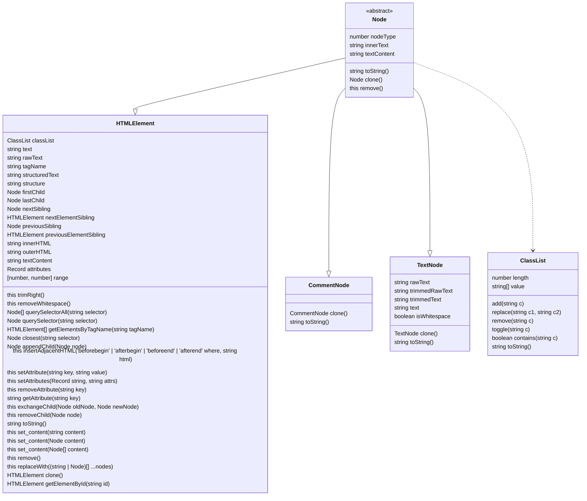

# Fast HTML Parser [](http://badge.fury.io/js/node-html-parser) [](https://actions-badge.atrox.dev/taoqf/node-html-parser/goto?ref=main)

Fast HTML Parser is a _very fast_ HTML parser. Which will generate a simplified
DOM tree, with element query support.

Per the design, it intends to parse massive HTML files in lowest price, thus the
performance is the top priority.  For this reason, some malformatted HTML may not
be able to parse correctly, but most usual errors are covered (eg. HTML4 style
no closing `<li>`, `<td>` etc).

## Install

```shell
npm install --save node-html-parser
```

> Note: when using Fast HTML Parser in a Typescript project the minimum Typescript version supported is `^4.1.2`.

## Performance

-- 2022-08-10

```shell
html-parser     :24.1595 ms/file ± 18.7667
htmljs-parser   :4.72064 ms/file ± 5.67689
html-dom-parser :2.18055 ms/file ± 2.96136
html5parser     :1.69639 ms/file ± 2.17111
cheerio         :12.2122 ms/file ± 8.10916
parse5          :6.50626 ms/file ± 4.02352
htmlparser2     :2.38179 ms/file ± 3.42389
htmlparser      :17.4820 ms/file ± 128.041
high5           :3.95188 ms/file ± 2.52313
node-html-parser:2.04288 ms/file ± 1.25203
node-html-parser (last release):2.00527 ms/file ± 1.21317
```

Tested with [htmlparser-benchmark](https://github.com/AndreasMadsen/htmlparser-benchmark).

## Usage

```ts
import { parse } from 'node-html-parser';

const root = parse('<ul id="list"><li>Hello World</li></ul>');

console.log(root.firstChild.structure);
// ul#list
//   li
//     #text

console.log(root.querySelector('#list'));
// { tagName: 'ul',
//   rawAttrs: 'id="list"',
//   childNodes:
//    [ { tagName: 'li',
//        rawAttrs: '',
//        childNodes: [Object],
//        classNames: [] } ],
//   id: 'list',
//   classNames: [] }
console.log(root.toString());
// <ul id="list"><li>Hello World</li></ul>
root.set_content('<li>Hello World</li>');
root.toString();	// <li>Hello World</li>
```

```js
var HTMLParser = require('node-html-parser');

var root = HTMLParser.parse('<ul id="list"><li>Hello World</li></ul>');
```

## Global Methods

### parse(data[, options])

Parse the data provided, and return the root of the generated DOM.

- **data**, data to parse
- **options**, parse options

  ```js
  {
    lowerCaseTagName: false,  // convert tag name to lower case (hurts performance heavily)
    comment: false,            // retrieve comments (hurts performance slightly)
    voidTag:{
      tags: ['area', 'base', 'br', 'col', 'embed', 'hr', 'img', 'input', 'link', 'meta', 'param', 'source', 'track', 'wbr'],	// optional and case insensitive, default value is ['area', 'base', 'br', 'col', 'embed', 'hr', 'img', 'input', 'link', 'meta', 'param', 'source', 'track', 'wbr']
      closingSlash: true     // optional, default false. void tag serialisation, add a final slash <br/>
    },
    blockTextElements: {
      script: true,	// keep text content when parsing
      noscript: true,	// keep text content when parsing
      style: true,		// keep text content when parsing
      pre: true			// keep text content when parsing
    }
  }
  ```

### valid(data[, options])

Parse the data provided, return true if the given data is valid, and return false if not.

## Class



## HTMLElement Methods

### trimRight()

Trim element from right (in block) after seeing pattern in a TextNode.

### removeWhitespace()

Remove whitespaces in this sub tree.

### querySelectorAll(selector)

Query CSS selector to find matching nodes.

Note: Full range of CSS3 selectors supported since v3.0.0.

### querySelector(selector)

Query CSS Selector to find matching node. `null` if not found.

### getElementsByTagName(tagName)

Get all elements with the specified tagName.

Note: Use * for all elements.

### closest(selector)

Query closest element by css selector. `null` if not found.

### appendChild(node)

Append a child node to childNodes

### insertAdjacentHTML(where, html)

Parses the specified text as HTML and inserts the resulting nodes into the DOM tree at a specified position.

### setAttribute(key: string, value: string)

Set `value` to `key` attribute.

### setAttributes(attrs: Record<string, string>)

Set attributes of the element.

### removeAttribute(key: string)

Remove `key` attribute.

### getAttribute(key: string)

Get `key` attribute. `undefined` if not set.

### exchangeChild(oldNode: Node, newNode: Node)

Exchanges given child with new child.

### removeChild(node: Node)

Remove child node.

### toString()

Same as [outerHTML](#htmlelementouterhtml)

### set_content(content: string | Node | Node[])

Set content. **Notice**: Do not set content of the **root** node.

### remove()

Remove current element.

### replaceWith(...nodes: (string | Node)[])

Replace current element with other node(s).

### classList

#### classList.add

Add class name.

#### classList.replace(old: string, new: string)

Replace class name with another one.

#### classList.remove()

Remove class name.

#### classList.toggle(className: string):void

Toggle class. Remove it if it is already included, otherwise add.

#### classList.contains(className: string): boolean

Returns true if the classname is already in the classList.

#### classList.value

Get class names.

#### clone()

Clone a node.

#### getElementById(id: string): HTMLElement | null

Get element by it's ID.

## HTMLElement Properties

### text

Get unescaped text value of current node and its children. Like `innerText`.
(slow for the first time)

### rawText

Get escaped (as-is) text value of current node and its children. May have
`&amp;` in it. (fast)

### tagName

Get or Set tag name of HTMLElement. Notice: the returned value would be an uppercase string.

### structuredText

Get structured Text.

### structure

Get DOM structure.

### firstChild

Get first child node. `undefined` if no child.

### lastChild

Get last child node. `undefined` if no child

### innerHTML

Set or Get innerHTML.

### outerHTML

Get outerHTML.

### nextSibling

Returns a reference to the next child node of the current element's parent. `null` if not found.

### nextElementSibling

Returns a reference to the next child element of the current element's parent. `null` if not found.

### previousSibling

Returns a reference to the previous child node of the current element's parent. `null` if not found.

### previousElementSibling

Returns a reference to the previous child element of the current element's parent. `null` if not found.

### textContent

Get or Set textContent of current element, more efficient than [set_content](#htmlelementset_contentcontent-string--node--node).

### attributes

Get all attributes of current element. **Notice: do not try to change the returned value.**

### range

Corresponding source code start and end indexes (ie [ 0, 40 ])
