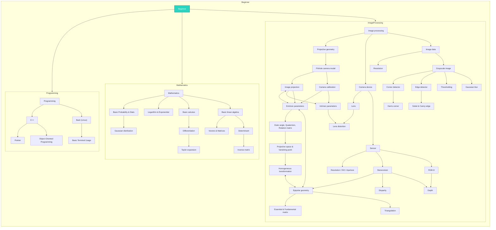

```mermaid
flowchart TD
    subgraph Beginner
    direction TB

        A[Beginner] --> Mathematics
        A[Beginner] --> Programming
        A[Beginner] --> ImageProcessing
        style A fill:#2dd4bf,stroke:#0d9488,stroke-width:2px,color:#ffffff

        subgraph Mathematics
        direction TB
            M[Mathematics] --> M1["Basic Probability & Stats"] --> M11["Gaussian distribution"]
            M[Mathematics] --> M2["Logarithm & Exponential"]
            M[Mathematics] --> M3["Basic Linear algebra"]
            M[Mathematics] --> M4["Basic calculus"] --> M41[Differentiation] --> M411[Taylor expansion]

            M3[Basic linear algebra] --> M31["Vectors & Matrices"]
            M3[Basic linear algebra] --> M32[Determinant] --> M321[Inverse matrix]
        end

        subgraph ImageProcessing
        direction TB
            I[Image processing] --> I1[Projective geometry]
            I[Image processing] --> I2[Camera device]
            I[Image processing] --> I3[Image data]

            I1[Projective geometry] --> I11["Pinhole camera model"]
            I11["Pinhole camera model"] --> I111["Image projection"]
            I11["Pinhole camera model"] --> I112["Camera calibration"]

            I111["Image projection"] <--> I1111["Extrinsic parameters"]
            I111["Image projection"] --> I1112["Intrinsic parameters"]
            I112["Camera calibration"] --> I1111["Extrinsic parameters"]
            I112["Camera calibration"] --> I1112["Intrinsic parameters"]

            I111["Image projection"] --> I1111["Rigid body motion"]
            I1111["Rigid body motion"] --> I11111["Euler angle, Quaternion, Rotation matrix"]
            I11111["Euler angle, Quaternion, Rotation matrix"] -->  I111111["Projective space & Vanishing point"]
            I111111["Projective space & Vanishing point"] --> I1111111["Homogeneous transformation"]

            I1111111["Homogeneous transformation"] <--> I2221["Epipolar geometry"]

            I1112["Intrinsic parameters"] --> I11121["Lens distortion"]

            I2["Camera device"] --> I21["Lens"] 
            I2["Camera device"] --> I22["Sensor"]

            I21["Lens"] --> I11121["Lens distortion"]

            I22["Sensor"] --> I221["Resolution / ISO / Aperture"]
            I22["Sensor"] --> I222["Stereovision"]
            I22["Sensor"] --> I223["RGB-D"]

            I222["Stereovision"] --> I2221["Epipolar geometry"]
            I222["Stereovision"] --> I2222["Disparity"]
            I222["Stereovision"] --> I2223["Depth"]

            I2221["Epipolar geometry"] <--> I1111["Extrinsic parameters"]
            I2221["Epipolar geometry"] --> I22211["Essential & Fundamental matrix"]
            I2221["Epipolar geometry"] --> I22212["Triangulation"]

            I223["RGB-D"] --> I2223["Depth"]

            I3["Image data"] --> I31["Resolution"]
            I3["Image data"] --> I32["Grayscale image"]

            I32["Grayscale image"] --> I321["Corner detector"] --> I3211["Harris corner"]
            I32["Grayscale image"] --> I322["Edge detector"] --> I3221["Sobel & Canny edge"]
            I32["Grayscale image"] --> I323["Thresholding"]  
            I32["Grayscale image"] --> I324["Gaussian blur"]


        end

        subgraph Programming
        direction TB
            P[Programming] --> P1["C++"]
            P[Programming] --> P2["Bash (Linux)"]

            P1[C++] --> P11[Pointer]
            P1[C++] --> P12["Object-Oriented Programming"]

            P2["Bash (Linux)"] --> P21["Basic Terminal Usage"]
        end

    end


```